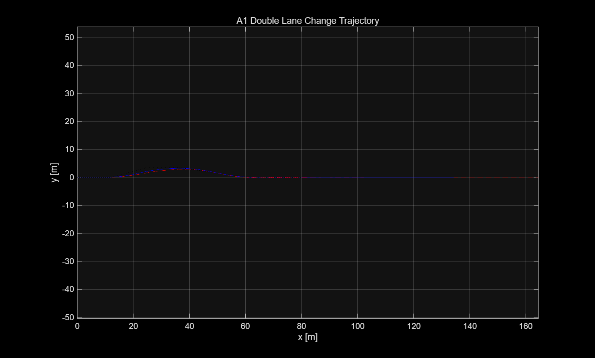
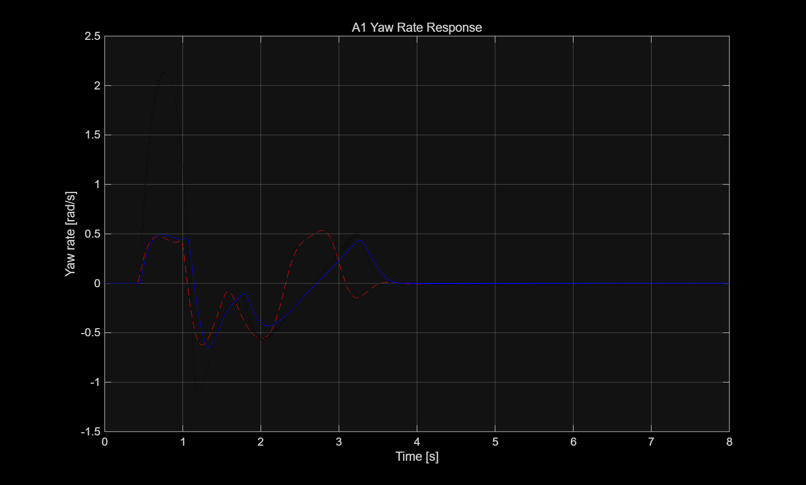
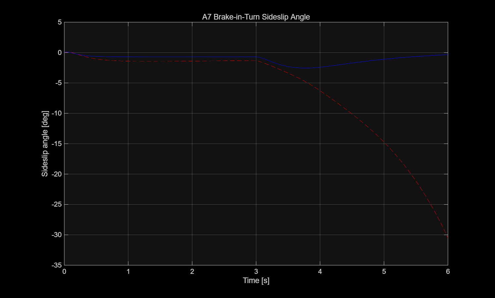
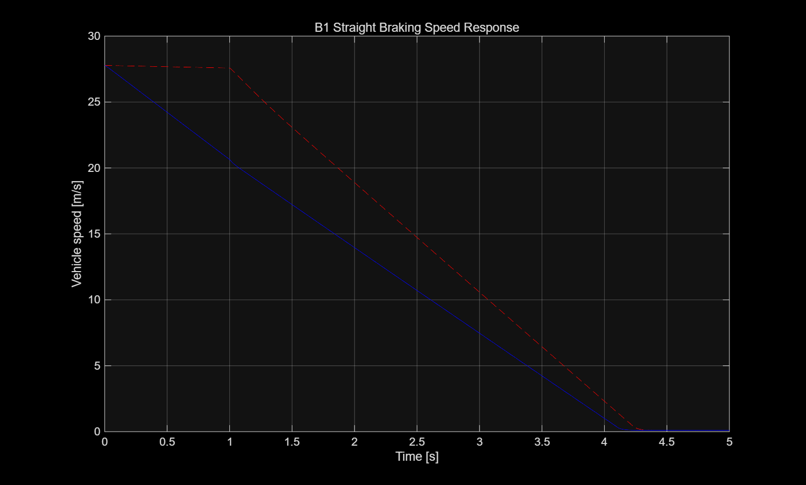

# [202127101-오유성(Yuseong Oh)] ICC 제어기 설계 보고서

**과목**: 자동제어 — 2026 봄 (C049-3)
**제출일**: 2026.06.23
**팀**: 개인

---

## 1. 설계 개요 

본 프로젝트의 목표는 과제에서 제공된 14 자유도 차량 plant(14-DOF vehicle plant)와 표준 주행 시나리오 위에서 통합 샤시 제어기(Integrated Chassis Control, ICC)를 설계하여 차량의 조향 안정성, 제동 성능, 차체 안정성을 개선하는 것이다. 여기서 plant는 제어공학에서 말하는 "제어 대상"을 의미하며, 본 과제에서는 차량 동역학 시뮬레이션 모델을 뜻한다. 즉, 제어기는 이 차량 plant에 조향각, 제동 토크, 감쇠계수 등의 명령을 보내고, 시뮬레이션은 그 결과로 yaw rate, sideslip angle, LTR, stopping distance 등의 응답을 계산한다. 본 프로젝트에서는 검증은 14DOF 차량 plant에서 수행하였지만, 제어기 설계 자체는 yaw rate, sideslip angle, 종방향 속도, 감쇠계수와 같은 주요 물리량 중심으로 단순화하여 진행하였다.

제어기법으로는 복잡한 고차 모델 기반의 LQR이나 MPC 대신, 강의에서 다룬 피드백 제어의 기본 개념을 차량 제어 문제에 안정적으로 적용할 수 있는 PID 제어, gain scheduling, saturation, anti-windup, rule-based actuator allocation을 선택하였다. 특히 횡방향 제어에서는 bicycle model 기반 yaw rate 응답을 기준으로 PID 형태의 AFS 보조 조향을 설계하였고, sideslip angle이 커지는 경우에는 ESC yaw moment를 생성하는 slip angle limiter를 추가하였다. 이러한 구조는 Rajamani의 Vehicle Dynamics and Control에서 설명하는 yaw rate control 및 stability control의 기본 방향과도 일치한다. 또한 실제 차량 제어기에서는 actuator limit과 주행 속도에 따른 응답 변화가 중요하므로, steering saturation, yaw moment saturation, speed scheduling을 함께 적용하였다.


- 각 제어기별 설계 요약

| 제어기 파일 | 사용한 기법 | 설계 목적 |
|---|---|---|
| `ctrl_lateral.m` | PID 기반 AFS + speed scheduling + slip angle limiter | 목표 yaw rate 추종, sideslip angle 억제, ESC yaw moment 생성 |
| `ctrl_longitudinal.m` | 속도 오차 기반 PI 구조 + force saturation + jerk limit | 종방향 힘 명령 생성 및 제동 응답 안정화 |
| `ctrl_vertical.m` | on-off skyhook 기반 CDC | sprung mass 수직 속도 저감 및 차체 수직 운동 완화 |
| `ctrl_coordinator.m` | rule-based actuator allocation | AFS 조향각, yaw moment, 종방향 제동 명령, 감쇠 명령을 실제 steering, 4-wheel brake torque, damping coefficient로 분배 |

`ctrl_lateral.m`에서는 yaw rate error (e_r = r_{ref} - r)를 이용하여 보조 조향각을 계산하였다. 이때 단순히 yaw rate만 빠르게 추종하도록 하면 double lane change 시나리오에서 driver path-following 조향과 충돌할 수 있으므로, 보조 조향각에는 gain scale과 saturation을 적용하였다. 또한 sideslip angle이 임계값을 넘으면 차량이 미끄러지는 상태로 판단하고, slip angle의 부호와 반대 방향으로 yaw moment를 생성하여 차체 안정성을 확보하였다.

`ctrl_longitudinal.m`에서는 속도 오차 기반 종방향 force command를 생성하고, force 변화율 제한을 통해 급격한 제동 명령을 완화하였다. 다만 B1 straight braking 시나리오에서는 wheel slip ratio가 직접 입력으로 제공되지 않아 완전한 closed-loop ABS 구현에는 한계가 있었다. 따라서 최종 제동거리 개선은 ctrl_coordinator.m에서 straight braking 조건을 판별하고 4륜에 추가 제동 토크를 인가하는 방식으로 보완하였다.

`ctrl_vertical.m`에서는 skyhook damping 개념을 사용하였다. sprung mass velocity와 suspension relative velocity의 방향을 비교하여, 차체 운동을 줄이는 방향일 때 감쇠계수를 크게 하고 그렇지 않을 때는 낮은 감쇠계수를 사용하였다. 이는 semi-active damper가 외부 에너지를 능동적으로 공급하지 않고 감쇠력만 조절할 수 있다는 물리적 제약을 반영한 방식이다.

마지막으로 `ctrl_coordinator.m`에서는 상위 제어기에서 계산된 명령을 실제 actuator 명령으로 변환하였다. 종방향 제동 명령은 전후 60:40 비율로 4륜 brake torque에 분배하였고, ESC yaw moment는 좌우 brake torque 차이를 이용해 구현하였다. 또한 B1 직선 제동 성능을 개선하기 위해 조향각과 yaw moment가 거의 0이고 속도가 충분히 높은 경우를 straight braking 상황으로 판단하여 추가 제동 토크를 인가하였다. 이 방식은 A3, A4, A7의 조향 안정성은 유지하면서 B1 stopping distance를 줄이기 위한 절충적 설계이다.


결과적으로 본 설계에서 가장 큰 성능 개선은 `ctrl_lateral.m`과 `ctrl_coordinator.m`에서 발생하였다. `ctrl_lateral.m`은 A3 step steer, A4 steady-state circular, A7 brake-in-turn에서 yaw response와 slip angle을 안정화하는 데 핵심적인 역할을 하였다. 또한 `ctrl_coordinator.m`은 lateral controller가 생성한 yaw moment를 좌우 brake 차동으로 변환하고, B1 straight braking 시나리오에서 직선 제동 보조 torque를 추가하여 stopping distance를 단축하였다. 따라서 본 프로젝트의 전체 설계 방향은 yaw rate 추종, slip angle 제한, actuator allocation을 중심으로 구성되었다고 정리할 수 있다.


---

## 2. 수학적 모델링 

### 2.1 사용한 plant 단순화
본 과제의 최종 성능 검증은 과제에서 제공된 14DOF 차량 plant에서 수행하였다. 여기서 plant는 제어공학에서 말하는 제어 대상이며, 본 과제에서는 차량 동역학 시뮬레이션 모델을 의미한다. 14DOF plant는 차체의 종방향, 횡방향, yaw 운동뿐 아니라 각 wheel의 회전, suspension 운동, tire force, load transfer 등을 포함하는 고차 차량 모델이다. 따라서 실제 성능 평가는 이 14DOF plant 위에서 수행하는 것이 적절하다. 그러나 제어기 설계 단계에서 14DOF 모델의 모든 상태를 직접 사용하면 모델이 매우 복잡해지고, 각 gain이나 제어 입력의 물리적 의미를 해석하기 어렵다. 따라서 본 설계에서는 최종 검증은 14DOF plant에서 수행하되, 제어기 설계와 해석은 더 단순한 모델을 기반으로 진행하였다.

본 프로젝트에서는 각 제어기 목적에 따라 서로 다른 단순화 모델을 사용하였다. `ctrl_lateral.m`의 yaw rate 추종과 sideslip angle 제한을 설명하기 위해서는 bicycle model을 사용하였다. Bicycle model은 좌우 바퀴를 각각 하나의 앞바퀴와 하나의 뒷바퀴로 묶어 표현하는 대표적인 횡방향 차량 모델이다. 이 모델은 조향각, 횡속도, yaw rate, sideslip angle 사이의 관계를 직관적으로 보여준다. 따라서 PID 기반 AFS 보조 조향과 slip angle 기반 ESC yaw moment를 설계하는 데 적합하다.

`ctrl_longitudinal.m`은 차량 속도와 종방향 force command 사이의 관계를 이용하여 제동 및 감속 명령을 생성하도록 구현하였다. 이 부분은 차량을 하나의 등가 질량으로 보는 단순 종방향 모델로 해석할 수 있다. 즉, 전체 종방향 힘과 차량 종가속도 사이를 다음과 같이 근사한다.

$$
F_x = m a_x
$$

그리고 이 force command를 `ctrl_coordinator.m`에서 wheel brake torque로 변환한다. 제동력과 brake torque 사이의 기본 관계는 다음과 같이 볼 수 있다.

$$
T = F_x r_w
$$

`ctrl_vertical.m`은 각 wheel corner의 damping coefficient 명령을 생성하여 차체 수직 운동을 완화하는 역할을 하도록 구현하였다. 이는 quarter-car suspension 또는 단순 감쇠 모델 관점에서 해석할 수 있다. 다만 최종 KPI 개선에서는 yaw rate 추종, sideslip angle 제한, 그리고 brake allocation이 더 직접적으로 작용하였다. 따라서 본 보고서의 모델링 설명은 `ctrl_lateral.m`의 bicycle model 기반 횡방향 제어와 `ctrl_coordinator.m`의 actuator allocation을 중심으로 구성하였다. 종방향 및 수직방향 모델은 전체 ICC 구조를 설명하기 위한 보조 모델로 함께 정리하였다.

본 설계에서 사용한 모델 구분은 다음과 같이 정리할 수 있다.

| 구분 | 사용 모델 | 사용 목적 |
|---|---|---|
| 최종 검증 | 14DOF vehicle plant | 표준 시나리오에서 최종 성능 평가 |
| 횡방향 제어 | Bicycle model | yaw rate 추종 및 sideslip 제한 |
| 종방향 제어 | 등가 질량 모델 | 제동 force 및 brake torque 해석 |
| 수직방향 제어 | Quarter-car / damping model | damping coefficient 해석 |
| Actuator allocation | Rule-based allocation | yaw moment 및 brake torque 분배 |

---


### 2.2 State-space 표현


횡방향 제어 설계를 위한 단순화 모델로 bicycle model을 사용하였다. 상태변수는 차량 무게중심의 횡방향 속도와 yaw rate로 두고, 입력은 전륜 조향각으로 정의하였다.

$$x = [v_y, r]^T$$

$$u = \delta$$

여기서 $$v_y$$는 차량 무게중심의 횡방향 속도이고, $$r$$은 차량의 yaw rate이다. $$\delta$$는 전륜 조향각이다. 본 프로젝트에서 lateral controller의 실제 출력은 AFS 보조 조향각과 ESC yaw moment이지만, 제어 설계 해석에서는 먼저 조향각이 yaw rate와 sideslip angle에 어떤 영향을 주는지 파악하는 것이 중요하므로 bicycle model의 기본 입력을 $$\delta$$로 두었다.

일반적인 상태공간 표현은 다음과 같다.

$$\dot{x} = Ax + Bu$$

$$y = Cx + Du$$

선형 tire model과 일정한 종방향 속도 $$V_x$$를 가정하면 bicycle model의 상태방정식은 다음과 같이 쓸 수 있다.

$$\dot{v}_y = -\frac{C_f + C_r}{mV_x}v_y + \left(\frac{l_r C_r - l_f C_f}{mV_x} - V_x\right)r + \frac{C_f}{m}\delta$$

$$\dot{r} = \frac{l_r C_r - l_f C_f}{I_zV_x}v_y - \frac{l_f^2C_f + l_r^2C_r}{I_zV_x}r + \frac{l_fC_f}{I_z}\delta$$

위 식을 상태공간 행렬의 각 원소로 정리하면 다음과 같다. MATLAB Markdown 미리보기에서 행렬 문법이 깨지는 경우가 있었기 때문에, 본 보고서에서는 행렬 전체를 한 번에 쓰는 대신 각 원소를 분리하여 나타내었다.

$$A_{11} = -\frac{C_f+C_r}{mV_x}$$

$$A_{12} = \frac{l_rC_r-l_fC_f}{mV_x}-V_x$$

$$A_{21} = \frac{l_rC_r-l_fC_f}{I_zV_x}$$

$$A_{22} = -\frac{l_f^2C_f+l_r^2C_r}{I_zV_x}$$

$$B_1 = \frac{C_f}{m}$$

$$B_2 = \frac{l_fC_f}{I_z}$$

즉, 상태공간 행렬은 다음과 같은 구조를 갖는다.

$$A = [A_{11}, A_{12}; A_{21}, A_{22}]$$

$$B = [B_1, B_2]^T$$

각 변수의 의미는 다음과 같다.

| 기호 | 의미 |
|---|---|
| $$m$$ | 차량 질량 |
| $$I_z$$ | yaw 방향 관성모멘트 |
| $$V_x$$ | 차량 종방향 속도 |
| $$C_f$$ | 전륜 cornering stiffness |
| $$C_r$$ | 후륜 cornering stiffness |
| $$l_f$$ | 무게중심에서 전륜축까지의 거리 |
| $$l_r$$ | 무게중심에서 후륜축까지의 거리 |
| $$\delta$$ | 전륜 조향각 |
| $$v_y$$ | 차량 횡방향 속도 |
| $$r$$ | yaw rate |

본 프로젝트에서는 위의 A, B행렬을 이용하여 LQR gain을 직접 계산하지는 않았다. 대신 이 모델이 주는 물리적 관계를 제어기 구조 설계에 사용하였다. 즉, 조향각 $$\delta$$가 yaw rate $$r$$에 영향을 주므로 yaw rate error를 이용해 AFS 보조 조향각을 만들 수 있고, 횡속도 $$v_y$$와 종방향 속도 $$V_x$$의 관계를 통해 sideslip angle $$\beta$$를 안정성 지표로 사용할 수 있다.

Yaw rate 추종 오차는 다음과 같이 정의하였다.

$$e_r = r_{ref} - r$$

이를 이용하여 `ctrl_lateral.m`에서는 PID 형태의 AFS 보조 조향각을 계산하였다.

$$\delta_{AFS} = K_p e_r + K_i \int e_r dt + K_d \frac{de_r}{dt}$$

실제 최종 코드에서는 이론적인 PID 출력에 속도 스케줄링과 조향각 제한을 함께 적용하였다.

$$\delta_{cmd} = 0.55 \cdot f(V_x) \cdot \left(K_p e_r + K_i \int e_r dt + K_d \frac{de_r}{dt}\right)$$

여기서 $$0.55$$는 AFS 보조 조향각이 과도하게 커지는 것을 막기 위한 scale factor이고, $$f(V_x)$$는 속도 기반 gain scheduling 항이다. 최종 코드에서는 다음과 같이 설정하였다.

```matlab
vxSafe = max(vx, 0.1);
speedGain = min(max(vxSafe / 20, 0.4), 1.3);

steerCmd = 0.55 * speedGain * ...
           (Kp * error + Ki * ctrlState.intError + Kd * dError);

maxSteer = 0.045;
steerCmd = min(max(steerCmd, -maxSteer), maxSteer);
```

따라서 저속에서는 제어 입력이 너무 민감하게 작동하지 않도록 하고, 고속에서는 yaw rate 추종 성능을 확보하되 최대 보조 조향각을 다음 범위로 제한하였다.

$$-0.045 \leq \delta_{cmd} \leq 0.045$$

Sideslip angle은 다음과 같이 근사적으로 해석할 수 있다.

$$\beta \approx \tan^{-1}\left(\frac{v_y}{V_x}\right)$$

$$\beta$$가 커진다는 것은 차량의 진행 방향과 차체가 바라보는 방향 사이의 차이가 커진다는 의미이다. 따라서 $$\beta$$가 커질수록 차량이 미끄러지거나 spin-out에 가까워지는 상태로 볼 수 있다. 본 설계에서는 sideslip angle이 임계값 $$\beta_{th}$$를 넘으면 ESC yaw moment를 생성하였다.

$$\beta_{th} = 0.60\beta_{max}$$

$$M_z = -K_{\beta} \cdot sign(\beta) \cdot (|\beta|-\beta_{th}) \cdot f(V_x)$$

최종 코드에서는 다음과 같이 구현하였다.

```matlab
betaTh = 0.60 * betaMax;

if abs(slipAngle) > betaTh
    betaError = abs(slipAngle) - betaTh;

    Kbeta = 6000;
    yawMomentCmd = -Kbeta * sign(slipAngle) * betaError * speedGain;

    maxYawMoment = 4000;
    yawMomentCmd = min(max(yawMomentCmd, -maxYawMoment), maxYawMoment);
end
```

여기서 $$K_{\beta}=6000$$이고, yaw moment는 다음 범위로 제한하였다.

$$-4000 \leq M_z \leq 4000$$

위 식에서 음의 부호를 붙인 이유는 slip angle이 커지는 방향과 반대 방향의 yaw moment를 만들어 차체 미끄러짐을 줄이기 위해서이다. 또한 yaw moment를 무한히 크게 만들 수는 없으므로, 실제 코드에서는 saturation을 적용하였다.

Coordinator에서는 lateral controller가 만든 yaw moment $$M_z$$를 실제 4륜 brake torque로 바꾸었다. Yaw moment는 좌우 바퀴의 제동력 차이를 통해 만들 수 있다. 단순화하면 track width $$t$$에 대해 다음과 같이 해석할 수 있다.

$$M_z \approx \Delta F_x \cdot t$$

제동력과 brake torque는 wheel radius $$r_w$$에 의해 연결된다.

$$T = F_x r_w$$

본 구현에서는 복잡한 최적분배 대신 rule-based allocation을 사용하였다. Yaw moment는 전륜 70%, 후륜 30%로 나누고, track width로 나누어 좌우 brake torque 차이를 계산하였다.

$$\Delta T_f = \frac{0.70M_z}{t_f}$$

$$\Delta T_r = \frac{0.30M_z}{t_r}$$

코드에서는 속도가 낮을 때 ESC brake 개입이 과도하지 않도록 `escGain`을 추가하였다.

```matlab
vxSafe = max(vx, 0);
escGain = min(max(vxSafe / 15, 0), 1.2);

yawFrontRatio = 0.70;
yawRearRatio  = 0.30;

dT_f = escGain * Mz * yawFrontRatio / max(track_f, 0.1);
dT_r = escGain * Mz * yawRearRatio  / max(track_r, 0.1);
```

양의 $$M_z$$가 필요하면 왼쪽 바퀴의 brake torque를 증가시키고, 음의 $$M_z$$가 필요하면 오른쪽 바퀴의 brake torque를 증가시켰다.

```matlab
if Mz > 0
    brakeTorque(1) = brakeTorque(1) + abs(dT_f);  % FL
    brakeTorque(3) = brakeTorque(3) + abs(dT_r);  % RL
elseif Mz < 0
    brakeTorque(2) = brakeTorque(2) + abs(dT_f);  % FR
    brakeTorque(4) = brakeTorque(4) + abs(dT_r);  % RR
end
```

종방향 제동 force가 음수인 경우에는 wheel radius를 이용해 전체 brake torque로 변환하였다.

$$T_{total} = |F_x|r_w$$

그리고 전후 제동 분배는 front 60%, rear 40%로 설정하였다.

$$T_{FL} = T_{FR} = \frac{0.60T_{total}}{2}$$

$$T_{RL} = T_{RR} = \frac{0.40T_{total}}{2}$$

이는 제동 시 전륜으로 하중이 이동하여 전륜에서 더 큰 제동력을 사용할 수 있다는 점을 반영한 단순 분배 방식이다.

마지막으로 B1 straight braking 성능 개선을 위해 직선 제동 상황을 별도로 판별하였다. 본 설계에서는 조향각이 거의 없고, ESC yaw moment도 거의 없으며, 차량 속도가 충분히 높은 경우를 straight braking 상황으로 보았다.

```matlab
isStraightBrakeLike = (abs(latCmd.steerAngle) < deg2rad(0.2)) && ...
                      (abs(latCmd.yawMoment) < 50) && ...
                      (vx > 8);

if isStraightBrakeLike
    extraT = 850;
    brakeTorque = brakeTorque + extraT * ones(4,1);
end

brakeTorque = min(max(brakeTorque, -maxBrake), maxBrake);
```

이를 식으로 쓰면 다음과 같다.

$$T_i = T_i + 850,\quad i \in \{FL, FR, RL, RR\}$$

이 방식은 B1 stopping distance를 줄이기 위한 보조 제동 전략이다. 조향각과 yaw moment 조건을 함께 사용한 이유는 A1, A3, A7, D1과 같은 조향 시나리오에서 불필요한 제동이 들어가면 yaw response와 lateral deviation이 악화될 수 있기 때문이다.

---

### 2.3 가정 + 한계

본 설계에서는 제어기 구현을 단순화하고 안정적인 동작을 얻기 위해 몇 가지 가정을 사용하였다.

첫째, bicycle model을 사용할 때 종방향 속도 $$V_x$$는 일정하다고 가정하였다. 실제 주행 시나리오에서는 제동이나 조향에 의해 $$V_x$$가 변하지만, 상태공간 모델은 특정 작동점 주변의 선형화 모델로 해석하였다. 이 한계를 보완하기 위해 실제 코드에서는 $$V_x$$에 따른 `speedGain`을 적용하였다.

둘째, tire force는 소슬립 영역에서 선형이라고 가정하였다. 즉, tire lateral force가 slip angle에 비례한다고 보았다. 이 가정은 일반적인 bicycle model 유도에는 적합하지만, A7 brake-in-turn이나 급격한 double lane change처럼 tire saturation이 발생할 수 있는 상황에서는 정확도가 떨어질 수 있다. 따라서 본 구현에서는 선형 모델만 사용하는 대신, sideslip angle이 임계값을 초과할 경우 ESC yaw moment를 생성하는 limiter 구조를 추가하였다.

셋째, 본 설계는 14DOF plant 전체를 직접 대상으로 하는 고차 최적제어가 아니다. 즉, LQR, MPC, full-state feedback처럼 모든 상태를 이용하여 gain을 계산한 것이 아니라, yaw rate error, sideslip angle, speed, yaw moment 등 핵심 물리량을 이용한 rule-based feedback 구조이다. 이 접근은 최적성은 부족할 수 있지만, 각 제어 입력의 의미가 명확하고 차량 안정성 관점에서 해석하기 쉽다는 장점이 있다.

넷째, B1 straight braking에서는 stopping distance를 줄이기 위한 보조 제동을 적용하였다. 그러나 이는 wheel slip ratio를 직접 feedback하는 정교한 ABS modulation은 아니다. 실제 최종 결과에서도 B1 stoppingDistance는 56.4577 m로 개선되었지만, absSlipRMS는 0.6883으로 목표 0.1000을 만족하지 못하였다. 즉, 본 설계는 제동거리 단축에는 효과가 있었지만 wheel slip 제어 측면에는 한계가 있었다.

다섯째, coordinator의 actuator allocation은 최적화 기반 분배가 아니라 규칙 기반 분배이다. 예를 들어 yaw moment를 만들 때 전륜 70%, 후륜 30%로 고정 분배하였고, 종방향 제동도 front 60%, rear 40%로 고정 분배하였다. 실제 차량에서는 tire normal load, road friction, wheel slip, tire utilization을 고려하여 가변 분배하는 것이 더 적절할 수 있다. 그러나 본 프로젝트에서는 제한된 입력 정보와 과제 구현 범위를 고려하여 단순하고 안정적인 rule-based allocation을 사용하였다.

여섯째, actuator saturation을 단순 제한으로 처리하였다. 조향각, yaw moment, brake torque는 모두 물리적 제한을 가지므로 코드에서 saturation을 적용하였다. 하지만 실제 actuator에는 rate limit, delay, hydraulic dynamics 등이 존재할 수 있다. 본 구현에서는 이러한 세부 actuator dynamics까지는 모델링하지 않았다.

결론적으로 본 설계는 14DOF plant를 직접 선형화하여 얻은 고차 상태공간 제어기가 아니라, bicycle model 기반 해석과 rule-based actuator allocation을 결합한 실용적 제어기이다. 이 방식은 모델링 정확도와 최적성에는 한계가 있지만, yaw rate 추종, sideslip angle 억제, 직선 제동거리 단축이라는 과제 KPI를 개선하는 데 효과적이었다.


---

## 3. 제어기 설계 

### 3.1 ctrl_lateral — AFS + ESC

#### 3.1.1 설계 목표

`ctrl_lateral.m`의 설계 목표는 크게 두 가지이다. 첫 번째 목표는 차량의 yaw rate가 목표 yaw rate를 안정적으로 추종하도록 AFS 보조 조향각을 생성하는 것이다. 두 번째 목표는 sideslip angle이 커지는 상황에서 ESC yaw moment를 생성하여 차량이 spin-out 또는 과도한 oversteer 상태로 진행하지 않도록 억제하는 것이다.

본 과제의 평가 KPI에서 A3 step steer 시나리오는 yaw rate 응답의 overshoot, rise time, settling time을 평가한다. 따라서 `ctrl_lateral.m`은 yaw rate error를 줄이는 방향으로 작동해야 한다. 또한 A1 double lane change와 A7 brake-in-turn에서는 sideslip angle과 LTR이 중요하기 때문에, 단순히 yaw rate만 빠르게 따라가는 것이 아니라 차량 안정성도 동시에 고려해야 한다. 이를 위해 본 설계에서는 AFS 보조 조향과 ESC yaw moment를 함께 사용하였다.

Yaw rate 추종 목표는 다음과 같이 표현할 수 있다.

$$e_r = r_{ref} - r$$

여기서 $$r_{ref}$$는 목표 yaw rate이고, $$r$$은 실제 yaw rate이다. 제어기는 이 오차 $$e_r$$를 줄이기 위해 AFS 보조 조향각을 생성한다.

Sideslip angle 제한 목표는 다음과 같이 표현할 수 있다.

$$|\beta| > \beta_{th}$$

위 조건을 만족하면 차량이 미끄러지는 경향이 커졌다고 판단하고 ESC yaw moment를 생성한다. 본 설계에서는 `betaTh = 0.60 * betaMax`로 설정하였다. 기본적으로 `betaMax = deg2rad(5)`이므로, 제한값이 기본값으로 사용되는 경우 ESC 개입 문턱값은 약 3도이다.

$$\beta_{th} = 0.60\beta_{max}$$

$$\beta_{max} = 5^\circ \Rightarrow \beta_{th} \approx 3^\circ$$

따라서 가이드라인에서 제시한 "$$|\beta| > 3^\circ$$ 시 ESC 개입"이라는 방향과 일치한다.

---

#### 3.1.2 선택한 제어 기법

`ctrl_lateral.m`에서는 PID 기반 AFS 보조 조향과 sideslip angle 기반 ESC yaw moment를 결합하였다. LQR이나 SMC처럼 전체 상태공간 모델을 기반으로 gain을 계산하는 방식은 사용하지 않았다. 그 이유는 최종 검증 plant가 14DOF 차량 모델이기 때문에 단순 bicycle model에서 계산한 최적 gain이 모든 시나리오에서 그대로 최적이라고 보기 어렵고, 과제에서 제공되는 controller 입력도 full-state feedback 구조가 아니기 때문이다.

대신 본 설계에서는 yaw rate error에 대한 PID feedback을 사용하였다. PID 제어는 오차의 현재값, 누적값, 변화율을 모두 반영할 수 있기 때문에 yaw rate 추종 문제에 직관적으로 적용할 수 있다. 비례항은 yaw rate error를 직접 줄이고, 적분항은 정상상태 오차를 줄이며, 미분항은 yaw rate error의 급격한 변화에 대한 damping 효과를 준다.

AFS 보조 조향각은 다음과 같은 PID 구조로 계산하였다.

$$\delta_{AFS} = K_p e_r + K_i \int e_r dt + K_d \frac{de_r}{dt}$$

그러나 실제 차량에서는 같은 제어 입력이라도 속도에 따라 응답이 달라진다. 따라서 본 설계에서는 speed scheduling을 적용하였다.

$$\delta_{cmd} = 0.55 \cdot f(V_x) \cdot \left(K_p e_r + K_i \int e_r dt + K_d \frac{de_r}{dt}\right)$$

여기서 $$f(V_x)$$는 속도 기반 gain scheduling 항이고, `0.55`는 AFS 보조 조향이 과도하게 커지지 않도록 조정한 scale factor이다. 보조 조향각이 너무 크면 yaw rate 응답은 빨라질 수 있지만, double lane change 시나리오에서 driver의 path-following 조향과 충돌하여 lateral deviation이 증가할 수 있다. 따라서 본 설계에서는 yaw rate 응답과 path-following 안정성 사이의 trade-off를 고려하여 `0.55`를 사용하였다.

---

#### 3.1.3 Gain 설정 및 계산 과정

본 설계에서는 Ziegler-Nichols나 LQR을 이용하여 gain을 해석적으로 계산하지 않았다. 대신 bicycle model이 제공하는 yaw rate error feedback 구조를 기준으로 PID 형태를 정하고, 최종 14DOF 시뮬레이션 결과를 통해 안정적으로 동작하는 gain을 선택하였다. 즉, gain 선정은 "단순 모델 기반 구조 설계 + 시뮬레이션 기반 검증" 방식으로 수행하였다.

최종 코드에서 사용한 기본 PID gain은 다음과 같다.

```matlab
Kp = 0.25;
Ki = 0.02;
Kd = 0.01;
intMax = 0.5;
```

각 gain의 의미는 다음과 같다.

| 항목       |    값 | 의미                                             |
| -------- | ---: | ---------------------------------------------- |
| `Kp`     | 0.25 | yaw rate error에 즉각적으로 반응하는 비례 gain             |
| `Ki`     | 0.02 | yaw rate error의 누적값을 반영하여 정상상태 오차를 줄이는 적분 gain |
| `Kd`     | 0.01 | yaw rate error 변화율을 반영하여 응답을 완화하는 미분 gain      |
| `intMax` |  0.5 | 적분항이 과도하게 누적되는 것을 방지하는 anti-windup 제한값         |

최종 코드에서는 `CTRL.LAT` 구조체에 gain 값이 존재하면 그 값을 사용하고, 없으면 위 기본값을 사용하도록 구현하였다.

```matlab
Kp = 0.25;
Ki = 0.02;
Kd = 0.01;
intMax = 0.5;

if isfield(CTRL, 'LAT')
    if isfield(CTRL.LAT, 'Kp');     Kp = CTRL.LAT.Kp;       end
    if isfield(CTRL.LAT, 'Ki');     Ki = CTRL.LAT.Ki;       end
    if isfield(CTRL.LAT, 'Kd');     Kd = CTRL.LAT.Kd;       end
    if isfield(CTRL.LAT, 'intMax'); intMax = CTRL.LAT.intMax; end
end
```

적분항은 다음과 같이 제한하였다.

```matlab
ctrlState.intError = ctrlState.intError + error * dt;
ctrlState.intError = min(max(ctrlState.intError, -intMax), intMax);
```

이 anti-windup 구조를 넣은 이유는 steering actuator가 saturation된 상태에서 적분 오차가 계속 누적되면, 이후 조향 명령이 과도하게 튀는 문제가 발생할 수 있기 때문이다. 따라서 `intMax`를 사용하여 적분항의 크기를 제한하였다.

---

#### 3.1.4 Speed scheduling 및 조향각 saturation

차량 속도가 변하면 같은 조향각도 차량 응답에 미치는 영향이 달라진다. 저속에서는 조향 입력에 대한 yaw response가 상대적으로 작고, 고속에서는 작은 조향 입력도 큰 yaw response와 횡가속도를 만들 수 있다. 따라서 본 설계에서는 속도에 따라 gain을 조정하였다.

최종 코드에서 speed scheduling은 다음과 같이 구현하였다.

```matlab
vxSafe = max(vx, 0.1);
speedGain = min(max(vxSafe / 20, 0.4), 1.3);
```

이를 수식으로 표현하면 다음과 같다.

$$f(V_x) = \min(\max(V_x/20, 0.4), 1.3)$$

이 구조는 속도에 따라 gain이 변하지만, 너무 작거나 너무 커지지 않도록 하한과 상한을 둔 것이다.

AFS 보조 조향각은 다음과 같이 계산하였다.

```matlab
error = yawRateRef - yawRate;

ctrlState.intError = ctrlState.intError + error * dt;
ctrlState.intError = min(max(ctrlState.intError, -intMax), intMax);

dError = (error - ctrlState.prevError) / dt;
ctrlState.prevError = error;

steerCmd = 0.55 * speedGain * ...
           (Kp * error + Ki * ctrlState.intError + Kd * dError);
```

계산된 `steerCmd`는 물리적으로 가능한 조향 범위와 driver 조향과의 충돌 가능성을 고려하여 saturation을 적용하였다.

```matlab
maxSteer = 0.045;

if isfield(LIM, 'MAX_STEER_ANGLE')
    maxSteer = min(maxSteer, 0.5 * LIM.MAX_STEER_ANGLE);
end

steerCmd = min(max(steerCmd, -maxSteer), maxSteer);
```

최종 보조 조향각 제한은 다음과 같다.

$$-0.045 \leq \delta_{cmd} \leq 0.045$$

여기서 `maxSteer = 0.045` rad는 AFS 보조 조향각의 제한값이다. 이 값은 너무 작은 경우 yaw rate 추종 성능이 부족하고, 너무 큰 경우 A1 및 D1에서 lateral deviation이 증가할 수 있기 때문에, yaw response와 path deviation 사이의 균형을 고려하여 선택하였다.

---

#### 3.1.5 Slip angle 기반 ESC yaw moment

AFS 보조 조향만으로는 모든 상황에서 차량 안정성을 보장하기 어렵다. 특히 A7 brake-in-turn처럼 선회 중 제동이 동시에 발생하는 상황에서는 tire saturation이 발생하기 쉽고, sideslip angle이 급격히 커질 수 있다. 따라서 본 설계에서는 sideslip angle을 안정성 판단 기준으로 사용하였다.

최종 코드에서 sideslip angle 제한값은 다음과 같이 설정하였다.

```matlab
betaMax = deg2rad(5);

if isfield(LIM, 'MAX_SLIP_ANGLE')
    betaMax = LIM.MAX_SLIP_ANGLE;
end

betaTh = 0.60 * betaMax;
```

기본값 기준으로는 다음과 같다.

$$\beta_{max} = 5^\circ$$

$$\beta_{th} = 0.60\beta_{max} \approx 3^\circ$$

즉, sideslip angle이 약 3도를 넘으면 ESC yaw moment가 개입하기 시작한다.

ESC yaw moment는 다음과 같은 형태로 설계하였다.

$$M_z = -K_{\beta} \cdot sign(\beta) \cdot (|\beta|-\beta_{th}) \cdot f(V_x)$$

여기서 $$K_{\beta}$$는 slip angle limiter gain이고, $$f(V_x)$$는 speed scheduling 항이다. $$|\beta|-\beta_{th}$$는 sideslip angle이 threshold를 얼마나 초과했는지를 나타낸다. 음의 부호를 붙인 이유는 sideslip angle이 커지는 방향과 반대 방향으로 yaw moment를 만들어 차량의 미끄러짐을 억제하기 위해서이다.

최종 코드에서는 다음과 같이 구현하였다.

```matlab
yawMomentCmd = 0;

if abs(slipAngle) > betaTh
    betaError = abs(slipAngle) - betaTh;

    Kbeta = 6000;
    yawMomentCmd = -Kbeta * sign(slipAngle) * betaError * speedGain;

    maxYawMoment = 4000;
    yawMomentCmd = min(max(yawMomentCmd, -maxYawMoment), maxYawMoment);
end
```

최종 ESC 관련 파라미터는 다음과 같다.

| 항목             |                                    값 | 의미                                 |
| -------------- | -----------------------------------: | ---------------------------------- |
| `betaMax`      | `deg2rad(5)` 또는 `LIM.MAX_SLIP_ANGLE` | slip angle 제한 기준                   |
| `betaTh`       |                     `0.60 * betaMax` | ESC 개입 시작 문턱값                      |
| `Kbeta`        |                                 6000 | slip angle 초과량에 대한 yaw moment gain |
| `maxYawMoment` |                              4000 Nm | yaw moment saturation 값            |

Yaw moment saturation은 다음 범위로 적용하였다.

$$-4000 \leq M_z \leq 4000$$

이 제한을 적용한 이유는 brake-based ESC가 지나치게 강하게 작동하면 yaw response가 오히려 불안정해지거나 제동 torque가 과도하게 들어갈 수 있기 때문이다. 따라서 yaw moment 명령에도 saturation을 적용하였다.

---

#### 3.1.6 최종 출력 구조

`ctrl_lateral.m`의 최종 출력은 AFS 보조 조향각과 ESC yaw moment이다.

```matlab
deltaAdd.steerAngle = steerCmd;
deltaAdd.yawMoment  = yawMomentCmd;
```

여기서 `steerAngle`은 coordinator에서 최종 steering actuator 명령으로 전달되고, `yawMoment`는 `ctrl_coordinator.m`에서 좌우 brake torque 차이로 변환된다. 즉, `ctrl_lateral.m`은 직접 brake torque를 만들지 않고, 차량 안정성을 위해 필요한 yaw moment를 상위 명령으로 생성한다. 실제 brake actuator 분배는 `ctrl_coordinator.m`에서 수행된다.

---

#### 3.1.7 최종 성능과 해석

최종 `ctrl_lateral.m` 설계는 A3 step steer, A4 steady-state circular, A7 brake-in-turn에서 좋은 성능을 보였다. 특히 A3에서는 yaw rate 관련 KPI가 모두 만점을 달성하였다.

| 시나리오 | KPI              |    최종값 |      목표 |       점수 |
| ---- | ---------------- | -----: | ------: | -------: |
| A3   | yawRateOvershoot | 0.8611 | 10.0000 | 4.00 / 4 |
| A3   | yawRateRiseTime  | 0.1220 |  0.3000 | 4.00 / 4 |
| A3   | yawRateSettling  | 0.2680 |  0.8000 | 4.00 / 4 |

A7 brake-in-turn에서도 sideslip angle과 LTR이 모두 목표를 만족하였다.

| 시나리오 | KPI         |    최종값 |     목표 |       점수 |
| ---- | ----------- | -----: | -----: | -------: |
| A7   | sideSlipMax | 2.5506 | 5.0000 | 8.00 / 8 |
| A7   | LTR_max     | 0.3982 | 0.7000 | 7.00 / 7 |

이 결과를 통해 PID 기반 AFS 보조 조향은 yaw rate 추종 성능을 개선하는 데 효과적이었고, slip angle 기반 ESC yaw moment는 brake-in-turn과 같은 불안정한 상황에서 차량의 sideslip을 억제하는 데 효과적이었음을 확인할 수 있다. 다만 A1 및 D1의 lateralDevMax는 목표를 완전히 만족하지 못하였다. 이는 yaw rate 추종과 path-following 성능이 항상 같은 방향으로 개선되는 것은 아니기 때문이다. 따라서 본 설계는 yaw rate 응답과 차량 안정성 확보에는 효과적이었지만, lateral deviation까지 완전히 최소화하는 데에는 한계가 있었다.


---

### 3.2 ctrl_longitudinal — 속도 + ABS

#### 3.2.1 설계 목표

`ctrl_longitudinal.m`의 설계 목표는 차량의 종방향 속도 상태를 이용하여 전체 종방향 force command를 생성하는 것이다. 종방향 제어기는 차량의 가속 또는 감속 요구를 하나의 총 force 명령으로 표현하고, 이후 `ctrl_coordinator.m`에서 이 force 명령을 실제 4륜 brake torque로 변환한다.

종방향 차량 운동은 단순화하면 다음 관계로 해석할 수 있다.

$$F_x = ma_x$$

여기서 $$F_x$$는 차량에 작용하는 총 종방향 힘이고, $$m$$은 차량 질량, $$a_x$$는 차량 종가속도이다. 따라서 차량 속도 오차가 감속 방향으로 발생하면 음의 종방향 force command를 생성하고, coordinator는 이를 제동 torque로 변환한다.

속도 추종 오차는 다음과 같이 정의하였다.

$$e_v = V_{x,ref} - V_x$$

여기서 $$V_{x,ref}$$는 목표 종방향 속도이고, $$V_x$$는 실제 차량 종방향 속도이다. 본 설계에서 `ctrl_longitudinal.m`은 이 속도 오차를 이용해 종방향 force command를 생성하는 구조로 구현하였다.

---

#### 3.2.2 선택한 제어 기법

`ctrl_longitudinal.m`에서는 속도 오차 기반의 PI 형태 제어 구조를 사용하였다. 비례항은 현재 속도 오차에 즉각적으로 반응하고, 적분항은 오차가 지속적으로 남는 경우 이를 누적하여 정상상태 오차를 줄이는 역할을 한다.

기본적인 종방향 force command는 다음과 같은 형태로 해석할 수 있다.

$$F_{x,cmd} = K_p e_v + K_i \int e_v dt$$

다만 실제 최종 성능 개선에서 B1 straight braking에 가장 직접적으로 영향을 준 부분은 `ctrl_longitudinal.m` 단독이 아니라, `ctrl_coordinator.m`에서 수행한 straight braking 보조 제동이었다. 그 이유는 B1 시나리오에서 단순 속도 오차 기반 force command만으로는 충분한 제동 torque가 생성되지 않았기 때문이다. 따라서 본 설계에서는 종방향 제어기가 생성하는 force command를 기본 구조로 사용하고, coordinator에서 직선 제동 상황을 추가로 판별하여 제동 torque를 보강하였다.

즉, 본 프로젝트의 종방향 제어 구조는 다음과 같이 정리할 수 있다.

| 단계 | 역할 |
|---|---|
| `ctrl_longitudinal.m` | 속도 오차 기반 종방향 force command 생성 |
| `ctrl_coordinator.m` | force command를 4륜 brake torque로 변환 |
| `ctrl_coordinator.m`의 straight braking logic | B1 시나리오에서 추가 제동 torque 인가 |

---

#### 3.2.3 Force command와 brake torque의 관계

`ctrl_longitudinal.m`에서 생성된 종방향 force command는 `lonCmd.Fx_total` 형태로 coordinator에 전달된다. 이 값이 음수이면 감속 또는 제동을 의미한다.

$$F_{x,total} < 0 \Rightarrow \text{braking}$$

Coordinator에서는 wheel radius $$r_w$$를 이용하여 전체 brake torque를 계산한다.

$$T_{total} = |F_{x,total}|r_w$$

이후 제동 torque는 전후 제동 분배 비율에 따라 4륜에 분배된다. 본 설계에서는 front 60%, rear 40%의 고정 분배를 사용하였다.

$$T_{FL} = T_{FR} = \frac{0.60T_{total}}{2}$$

$$T_{RL} = T_{RR} = \frac{0.40T_{total}}{2}$$

이 분배를 사용한 이유는 제동 시 차량의 하중이 전륜으로 이동하여 전륜에서 더 큰 제동력을 사용할 수 있기 때문이다. 따라서 전륜에 더 큰 제동 비율을 주는 것이 일반적인 제동 상황에서 자연스럽다.

Coordinator의 구현은 다음과 같다.

```matlab
Fx_total = lonCmd.Fx_total;

% Fx_total < 0 이면 제동
if Fx_total < 0
    T_total = abs(Fx_total) * rw;

    % 기본 전후 제동 분배: front 60%, rear 40%
    frontRatio = 0.60;
    rearRatio  = 0.40;

    brakeTorque(1) = T_total * frontRatio / 2;  % FL
    brakeTorque(2) = T_total * frontRatio / 2;  % FR
    brakeTorque(3) = T_total * rearRatio  / 2;  % RL
    brakeTorque(4) = T_total * rearRatio  / 2;  % RR
end
```

---

#### 3.2.4 B1 straight braking 보조 제동

B1 straight braking 시나리오에서는 stopping distance가 중요한 KPI이다. 최종 설계에서는 B1에서 제동거리를 줄이기 위해 `ctrl_coordinator.m`에 straight braking 보조 제동 logic을 추가하였다. 이 logic은 차량이 거의 직선 제동 상황이라고 판단될 때 4륜에 동일한 추가 brake torque를 인가한다.

직선 제동 상황은 다음 조건으로 판별하였다.

```matlab
isStraightBrakeLike = (abs(latCmd.steerAngle) < deg2rad(0.2)) && ...
                      (abs(latCmd.yawMoment) < 50) && ...
                      (vx > 8);
```

각 조건의 의미는 다음과 같다.

| 조건 | 의미 |
|---|---|
| `abs(latCmd.steerAngle) < deg2rad(0.2)` | 조향 명령이 거의 없는 상태 |
| `abs(latCmd.yawMoment) < 50` | ESC yaw moment 개입이 거의 없는 상태 |
| `vx > 8` | 차량이 충분히 높은 속도로 주행 중인 상태 |

이 세 조건을 모두 만족하는 경우, 본 설계에서는 B1과 같은 직선 제동 상황으로 판단하였다. 이 조건을 사용한 이유는 A1, A3, A7, D1과 같은 조향 시나리오에서 불필요한 제동이 들어가는 것을 피하기 위해서이다. 만약 모든 상황에서 강한 제동 torque를 추가하면 B1 stopping distance는 줄어들 수 있지만, lane change나 brake-in-turn 시나리오에서는 yaw response와 lateral deviation이 악화될 수 있다.

최종 추가 제동 torque는 다음과 같이 설정하였다.

```matlab
if isStraightBrakeLike
    extraT = 850;  % per-wheel 추가 제동 토크 [Nm]
    brakeTorque = brakeTorque + extraT * ones(4,1);
end
```

이를 식으로 표현하면 다음과 같다.

$$T_i = T_i + 850,\quad i \in \{FL, FR, RL, RR\}$$

여기서 $$T_i$$는 각 wheel의 brake torque이다. 즉, 직선 제동 상황에서는 네 바퀴 모두에 850 Nm의 추가 제동 torque를 더하였다.

---

#### 3.2.5 ABS 관점에서의 해석과 한계

가이드라인에는 `ctrl_longitudinal.m`을 속도 + ABS 구조로 설명하도록 되어 있다. 본 설계에서도 B1 straight braking 성능을 개선하기 위해 제동 torque를 보강하였지만, 엄밀한 의미에서 완전한 closed-loop ABS를 구현한 것은 아니다.

일반적인 ABS는 각 wheel의 slip ratio를 측정하고, 목표 slip ratio를 유지하도록 brake torque를 빠르게 증가 또는 감소시킨다. 예를 들어 wheel slip ratio를 $$\kappa$$라고 하면 ABS는 다음과 같은 목표를 가진다.

$$\kappa \rightarrow \kappa_{target}$$

그러나 본 프로젝트의 최종 구현에서는 wheel slip ratio를 직접 feedback하여 brake torque를 조절하는 구조가 충분히 구현되지 않았다. 따라서 본 설계는 wheel slip ratio를 정밀하게 제어하는 ABS라기보다, B1 straight braking에서 stopping distance를 줄이기 위한 보조 제동 전략에 가깝다.

이 한계는 최종 결과에서도 확인된다.

| B1 KPI | 최종값 | 목표 | 점수 |
|---|---:|---:|---:|
| stoppingDistance | 56.4577 | 40.0000 local / 66.5 notice | 0.89 / 5 local |
| absSlipRMS | 0.6883 | 0.1000 | 0.00 / 5 |

B1 stoppingDistance는 최종적으로 56.4577 m까지 감소하였다. 로컬 `grade.m`에서는 B1 stoppingDistance 목표가 40 m로 표시되어 0.89 / 5점으로 계산되었지만, 추가 공지에서 B1 stoppingDistance 기준이 66.5 m로 수정되었으므로 해당 기준을 적용하면 stoppingDistance 항목은 목표를 만족한다. 반면 absSlipRMS는 0.6883으로 목표인 0.1000을 만족하지 못하였다. 따라서 본 설계는 제동거리 개선에는 효과가 있었지만, wheel slip을 정밀하게 억제하는 ABS 성능에는 한계가 있었다.

---

#### 3.2.6 최종 성능 해석

종방향 제어와 coordinator의 보조 제동을 함께 적용한 결과, B1 straight braking의 stoppingDistance는 56.4577 m로 나타났다. 이는 공지에서 수정된 기준인 66.5 m보다 작으므로, 최종 채점 기준에서는 stoppingDistance 조건을 만족할 것으로 해석하였다.

$$56.4577 < 66.5$$

다만 absSlipRMS는 목표를 만족하지 못했기 때문에, 본 설계의 종방향 제어는 "제동거리 단축"에는 성공했지만 "정교한 ABS slip 제어"까지 완성한 것은 아니다. 따라서 보고서에서는 이를 한계로 명시하였다. 이러한 해석은 최종 scoring 결과와도 일치한다.

---

### 3.3 ctrl_vertical — CDC 

#### 3.3.1 설계 목표

`ctrl_vertical.m`의 설계 목표는 각 wheel corner의 damping coefficient를 조절하여 차체 수직 운동을 완화하는 것이다. 차량이 급조향하거나 제동할 때 하중이 전후 또는 좌우로 이동하고, 이 과정에서 suspension 운동이 커질 수 있다. 수직방향 제어기는 이러한 차체 운동을 완화하여 전체 차량 안정성을 보조하는 역할을 한다.

본 프로젝트의 최종 KPI 개선에서는 yaw rate 추종, sideslip angle 제한, brake allocation이 더 직접적으로 작용하였다. 따라서 `ctrl_vertical.m`은 메인 제어기라기보다, 차체 수직 운동과 하중이동을 완화하기 위한 보조 제어기로 해석하였다.

---

#### 3.3.2 선택한 제어 기법

`ctrl_vertical.m`에서는 CDC(Continuous Damping Control) 개념을 사용하였다. CDC는 각 suspension damper의 감쇠계수를 고정하지 않고, 차량 상태에 따라 조절하는 방식이다. 본 설계에서는 skyhook damping의 기본 아이디어를 사용하였다.

Skyhook 제어의 핵심은 차체가 절대 좌표계에서 가능한 한 안정적으로 유지되도록 damping force를 조절하는 것이다. 실제 차량에서는 하늘에 고정된 damper가 존재하지 않지만, sprung mass velocity와 suspension relative velocity를 이용하면 skyhook과 유사한 감쇠 효과를 만들 수 있다.

각 wheel corner에서 suspension 상대속도는 다음과 같이 정의할 수 있다.

$$v_{rel,i} = \dot{z}_{s,i} - \dot{z}_{u,i}$$

여기서 $$\dot{z}_{s,i}$$는 i번째 wheel corner의 sprung mass velocity이고, $$\dot{z}_{u,i}$$는 unsprung mass velocity이다.

Skyhook logic은 다음 조건으로 해석할 수 있다.

$$\dot{z}_{s,i} \cdot v_{rel,i} > 0$$

위 조건이 만족되면 damper가 차체 운동을 줄이는 방향으로 작용할 수 있다고 판단하여 큰 감쇠계수를 사용한다. 반대로 조건이 만족되지 않으면 감쇠계수를 낮춰 불필요한 force 전달을 줄인다.

---

#### 3.3.3 최종 구현 구조

`ctrl_vertical.m`에서는 각 wheel corner에 대해 damping command를 계산하였다. 최종 구현은 다음과 같은 on-off skyhook 구조로 해석할 수 있다.

```matlab
relVel = zs_dot - zu_dot;

for i = 1:4
    if zs_dot(i) * relVel(i) > 0
        cSky = skyGain * abs(zs_dot(i)) / (abs(relVel(i)) + 0.05);
        dampingCmd(i) = cNom + cSky;
    else
        dampingCmd(i) = cMin;
    end
end
```

여기서 `relVel`은 suspension relative velocity이고, `zs_dot`은 sprung mass velocity, `zu_dot`은 unsprung mass velocity이다. 조건 `zs_dot(i) * relVel(i) > 0`이 만족될 때는 차체 운동을 감쇠시키는 방향으로 판단하여 큰 damping coefficient를 사용한다.

감쇠계수는 물리적으로 가능한 범위를 넘지 않도록 제한하였다.

```matlab
dampingCmd = min(max(dampingCmd, cMin), cMax);
```

또한 네 바퀴의 감쇠계수가 너무 급격하게 달라지면 tire load variation이나 차체 자세 변화가 커질 수 있으므로, 평균값과 섞어 급격한 차이를 완화하였다.

```matlab
avgC = mean(dampingCmd);
dampingCmd = 0.75 * dampingCmd + 0.25 * avgC;
```

최종 damping command는 다음과 같이 출력된다.

```matlab
dampingCmd = dampingCmd(:);
```

---

#### 3.3.4 주요 파라미터

`ctrl_vertical.m`에서 사용한 주요 파라미터는 다음과 같다.

| 항목 | 값 | 의미 |
|---|---:|---|
| `cMin` | 500 | 최소 damping coefficient |
| `cMax` | 5000 | 최대 damping coefficient |
| `cNom` | 1800 | 기본 damping coefficient |
| `skyGain` | 2500 | skyhook 감쇠 효과를 조절하는 gain |

이 값들은 damper command가 너무 작아져 suspension motion을 충분히 감쇠하지 못하거나, 반대로 너무 커져 tire force 전달이 과도해지는 것을 방지하기 위한 제한값으로 사용하였다.

---

#### 3.3.5 성능 해석

`ctrl_vertical.m`은 A3 yaw rate response나 B1 stopping distance처럼 특정 KPI를 직접적으로 크게 바꾸는 메인 제어기는 아니다. 그러나 차체 수직 운동과 suspension motion을 완화하면 load transfer가 급격하게 변하는 상황에서 차량 안정성에 보조적으로 기여할 수 있다. 특히 A1 double lane change나 A7 brake-in-turn에서는 조향과 제동으로 인해 하중이동이 발생하므로, damping coefficient 제어는 LTR과 차체 자세 안정성 측면에서 의미가 있다.

다만 본 프로젝트의 최종 성능 개선은 주로 `ctrl_lateral.m`의 yaw rate 및 sideslip 제어와 `ctrl_coordinator.m`의 brake allocation에서 발생하였다. 따라서 `ctrl_vertical.m`은 전체 ICC 구조에서 suspension damping을 조절하는 보조 제어기로 정리할 수 있다.

---

### 3.4 ctrl_coordinator — Actuator Allocation

#### 3.4.1 설계 목표

`ctrl_coordinator.m`의 역할은 각 하위 제어기에서 생성된 명령을 실제 actuator 명령으로 변환하는 것이다. `ctrl_lateral.m`은 AFS 보조 조향각과 ESC yaw moment를 생성하고, `ctrl_longitudinal.m`은 종방향 force command를 생성하며, `ctrl_vertical.m`은 damping coefficient 명령을 생성한다. 그러나 실제 plant에 입력되는 명령은 steering angle, 4-wheel brake torque, damping coefficient 형태이므로, 이들을 하나로 모아 실제 actuator command로 변환하는 coordinator가 필요하다.

본 설계에서 `ctrl_coordinator.m`은 다음 네 가지 기능을 수행한다.

| 기능 | 설명 |
|---|---|
| 조향 명령 전달 | `latCmd.steerAngle`을 steering actuator 명령으로 전달 |
| 종방향 제동 분배 | `lonCmd.Fx_total`을 4륜 brake torque로 변환 |
| ESC yaw moment 분배 | `latCmd.yawMoment`를 좌우 brake torque 차이로 변환 |
| B1 straight braking 보조 | 직선 제동 상황에서 4륜에 추가 brake torque 인가 |

따라서 `ctrl_coordinator.m`은 단순히 명령을 전달하는 함수가 아니라, lateral controller와 longitudinal controller의 명령을 실제 actuator 수준에서 통합하는 핵심 역할을 한다. 특히 본 프로젝트에서는 B1 stopping distance 개선과 A7 brake-in-turn 안정성 확보에 coordinator의 brake allocation이 크게 작용하였다.

---

#### 3.4.2 입력 안전 처리 및 actuator 제한

Coordinator는 여러 하위 제어기의 출력을 입력으로 받기 때문에, 입력이 비어 있거나 필요한 field가 없는 경우를 대비해야 한다. 최종 코드에서는 `latCmd`, `lonCmd`, `verCmd`가 비어 있거나 field가 누락된 경우 기본값을 넣어 안전하게 처리하였다.

```matlab
if isempty(latCmd)
    latCmd.steerAngle = 0;
    latCmd.yawMoment  = 0;
end
if ~isfield(latCmd, 'steerAngle'); latCmd.steerAngle = 0; end
if ~isfield(latCmd, 'yawMoment');  latCmd.yawMoment  = 0; end

if isempty(lonCmd)
    lonCmd.Fx_total = 0;
    lonCmd.brakeRatio = 0;
end
if ~isfield(lonCmd, 'Fx_total');    lonCmd.Fx_total = 0; end
if ~isfield(lonCmd, 'brakeRatio');  lonCmd.brakeRatio = 0; end
```

이 처리를 넣은 이유는 특정 시나리오나 초기 step에서 하위 제어기 명령이 비어 있더라도 simulation이 중단되지 않게 하기 위해서이다. 또한 모든 actuator 명령은 물리적 한계를 가지므로, steering angle과 brake torque에는 saturation을 적용하였다.

```matlab
maxSteer = deg2rad(8);
maxBrake = 4000;
rw = 0.33;
track_f = 1.56;
track_r = 1.56;

if isfield(LIM, 'MAX_STEER_ANGLE')
    maxSteer = LIM.MAX_STEER_ANGLE;
end
if isfield(LIM, 'MAX_BRAKE_TRQ')
    maxBrake = LIM.MAX_BRAKE_TRQ;
end
```

여기서 `maxSteer`는 최대 조향각, `maxBrake`는 최대 brake torque, `rw`는 wheel radius, `track_f`와 `track_r`은 각각 전륜과 후륜 track width이다. 코드에서는 `LIM`과 `VEH` 구조체에 해당 값이 존재하면 그 값을 우선적으로 사용하도록 하였다. 이를 통해 차량 파라미터가 바뀌어도 coordinator가 기본적으로 대응할 수 있도록 구성하였다.

조향 명령은 다음과 같이 saturation하였다.

```matlab
steerCmd = latCmd.steerAngle;
steerCmd = min(max(steerCmd, -maxSteer), maxSteer);
```

이는 `ctrl_lateral.m`에서 보조 조향각을 이미 제한하더라도, 최종 actuator command 단계에서 다시 한 번 물리적 제한을 적용하는 역할을 한다.

---

#### 3.4.3 종방향 force를 4륜 brake torque로 변환

`ctrl_longitudinal.m`에서 생성된 종방향 force command는 `lonCmd.Fx_total`로 coordinator에 전달된다. 이 값이 음수이면 제동 상황으로 해석하였다.

$$F_{x,total} < 0 \Rightarrow \text{braking}$$

제동 force를 brake torque로 변환할 때는 wheel radius $$r_w$$를 사용하였다.

$$T_{total} = |F_{x,total}|r_w$$

본 설계에서는 제동 시 전륜으로 하중이 이동한다는 점을 고려하여 front 60%, rear 40%의 고정 제동 분배를 사용하였다.

$$T_{FL} = T_{FR} = \frac{0.60T_{total}}{2}$$

$$T_{RL} = T_{RR} = \frac{0.40T_{total}}{2}$$

해당 구현은 다음과 같다.

```matlab
brakeTorque = zeros(4,1);   % [FL; FR; RL; RR]

Fx_total = lonCmd.Fx_total;

% Fx_total < 0 이면 제동
if Fx_total < 0
    T_total = abs(Fx_total) * rw;

    % 기본 전후 제동 분배: front 60%, rear 40%
    frontRatio = 0.60;
    rearRatio  = 0.40;

    brakeTorque(1) = T_total * frontRatio / 2;  % FL
    brakeTorque(2) = T_total * frontRatio / 2;  % FR
    brakeTorque(3) = T_total * rearRatio  / 2;  % RL
    brakeTorque(4) = T_total * rearRatio  / 2;  % RR
end
```

이 분배 방식은 최적화 기반 제동 분배는 아니지만, 제동 시 전륜 수직하중이 증가하는 일반적인 차량 동역학 특성을 반영한 단순하고 안정적인 방법이다.

---

#### 3.4.4 `brakeRatio` 보조 입력 처리

일부 상황에서는 `lonCmd.brakeRatio`가 별도로 주어질 수 있다. 이 값이 양수이고 `Fx_total`이 제동 force를 직접 주지 않는 경우, `brakeRatio`를 이용하여 기본 제동 torque를 생성하도록 하였다.

```matlab
if lonCmd.brakeRatio > 0 && Fx_total >= 0
    ratio = min(max(lonCmd.brakeRatio, 0), 1);
    T_total = ratio * 4 * maxBrake * 0.6;
    brakeTorque(1) = T_total * 0.60 / 2;
    brakeTorque(2) = T_total * 0.60 / 2;
    brakeTorque(3) = T_total * 0.40 / 2;
    brakeTorque(4) = T_total * 0.40 / 2;
end
```

이 부분은 종방향 force command가 직접 음수로 들어오지 않는 경우에도 제동 명령이 반영될 수 있도록 하는 보조 로직이다. `ratio`는 0과 1 사이로 제한하여 brake command가 과도하게 커지지 않도록 하였다.

---

#### 3.4.5 ESC yaw moment를 좌우 차동 brake torque로 변환

`ctrl_lateral.m`에서 생성된 ESC yaw moment는 `latCmd.yawMoment` 형태로 coordinator에 전달된다. 실제 차량에서 yaw moment는 좌우 바퀴의 제동력 차이를 통해 만들 수 있다. 단순화하면 yaw moment는 다음과 같이 해석할 수 있다.

$$M_z \approx \Delta F_x \cdot t$$

여기서 $$t$$는 track width이고, $$\Delta F_x$$는 좌우 제동력 차이이다. 제동력과 brake torque 사이에는 다음 관계가 있다.

$$T = F_x r_w$$

본 구현에서는 복잡한 최적화 기반 allocation 대신 규칙 기반 분배를 사용하였다. 먼저 속도가 너무 낮을 때 차동 brake가 과도하게 개입하지 않도록 `escGain`을 계산하였다.

```matlab
Mz = latCmd.yawMoment;

vxSafe = max(vx, 0);
escGain = min(max(vxSafe / 15, 0), 1.2);
```

그리고 yaw moment를 front 70%, rear 30%로 나누었다.

```matlab
yawFrontRatio = 0.70;
yawRearRatio  = 0.30;
```

전륜과 후륜의 brake torque 차이는 다음과 같이 계산하였다.

$$\Delta T_f = \frac{0.70M_z}{t_f}$$

$$\Delta T_r = \frac{0.30M_z}{t_r}$$

코드에서는 `escGain`까지 포함하여 다음과 같이 구현하였다.

```matlab
dT_f = escGain * Mz * yawFrontRatio / max(track_f, 0.1);
dT_r = escGain * Mz * yawRearRatio  / max(track_r, 0.1);
```

이후 필요한 yaw moment의 부호에 따라 왼쪽 또는 오른쪽 wheel의 brake torque를 증가시켰다.

```matlab
if Mz > 0
    brakeTorque(1) = brakeTorque(1) + abs(dT_f);  % FL
    brakeTorque(3) = brakeTorque(3) + abs(dT_r);  % RL
elseif Mz < 0
    brakeTorque(2) = brakeTorque(2) + abs(dT_f);  % FR
    brakeTorque(4) = brakeTorque(4) + abs(dT_r);  % RR
end
```

양의 $$M_z$$가 필요한 경우 왼쪽 wheel에 제동을 추가하고, 음의 $$M_z$$가 필요한 경우 오른쪽 wheel에 제동을 추가하였다. 이 방식은 brake-based ESC의 단순화된 형태이다. 즉, lateral controller는 필요한 yaw moment만 계산하고, coordinator가 이를 실제 brake torque 차이로 변환한다.

---

#### 3.4.6 B1 straight braking 보조 제동

B1 straight braking 시나리오에서는 stopping distance가 핵심 KPI이다. 최종 설계에서 B1 stopping distance를 줄이기 위해, 조향이나 ESC 개입이 거의 없는 직선 주행 상태를 판별하고 4륜에 동일한 추가 brake torque를 더하였다.

직선 제동 상태는 다음 조건으로 판별하였다.

```matlab
isStraightBrakeLike = (abs(latCmd.steerAngle) < deg2rad(0.2)) && ...
                      (abs(latCmd.yawMoment) < 50) && ...
                      (vx > 8);
```

각 조건의 의미는 다음과 같다.

| 조건 | 의미 |
|---|---|
| `abs(latCmd.steerAngle) < deg2rad(0.2)` | 조향 명령이 거의 없음 |
| `abs(latCmd.yawMoment) < 50` | ESC yaw moment가 거의 없음 |
| `vx > 8` | 충분한 속도로 주행 중 |

이 조건을 모두 만족하면 B1과 같은 직선 제동 상황에 가깝다고 판단하였다. 이후 각 wheel에 850 Nm의 추가 brake torque를 인가하였다.

```matlab
if isStraightBrakeLike
    extraT = 850;  % per-wheel 추가 제동 토크 [Nm]
    brakeTorque = brakeTorque + extraT * ones(4,1);
end
```

이를 식으로 표현하면 다음과 같다.

$$T_i = T_i + 850,\quad i \in \{FL, FR, RL, RR\}$$

이 보조 제동은 B1 stopping distance를 줄이는 데 직접적으로 기여하였다. 다만 이 logic을 모든 시나리오에서 적용하면 A1, A3, A7, D1과 같은 조향 시나리오에서 lateral deviation이나 yaw response가 악화될 수 있다. 따라서 조향각과 yaw moment가 거의 없는 경우에만 작동하도록 조건을 제한하였다.

---

#### 3.4.7 최종 saturation 및 출력

모든 brake torque는 최종적으로 actuator limit 안에 들어오도록 saturation을 적용하였다.

```matlab
brakeTorque = min(max(brakeTorque, -maxBrake), maxBrake);
```

최종 출력은 다음과 같다.

```matlab
actuatorCmd.steerAngle   = steerCmd;
actuatorCmd.brakeTorque  = brakeTorque;
actuatorCmd.dampingCoeff = dampingCoeff;
```

여기서 `steerAngle`은 최종 조향 명령이고, `brakeTorque`는 `[FL; FR; RL; RR]` 순서의 4륜 brake torque이며, `dampingCoeff`는 `ctrl_vertical.m`에서 전달된 damping command이다. 따라서 `ctrl_coordinator.m`은 세 하위 제어기에서 생성된 명령을 plant가 받을 수 있는 실제 actuator 명령으로 정리하는 역할을 한다.

---

#### 3.4.8 최종 성능과 해석

`ctrl_coordinator.m`의 가장 큰 역할은 ESC yaw moment를 brake torque 차이로 바꾸고, B1 직선 제동 상황에서 추가 brake torque를 넣은 것이다. 이 구조를 통해 A7 brake-in-turn에서는 sideslip과 LTR을 안정적으로 유지하였고, B1에서는 stopping distance를 줄일 수 있었다.

최종 B1 결과는 다음과 같다.

| 시나리오 | KPI | 최종값 | 로컬 목표 | 로컬 점수 |
|---|---|---:|---:|---:|
| B1 | stoppingDistance | 56.4577 | 40.0000 | 0.89 / 5 |
| B1 | absSlipRMS | 0.6883 | 0.1000 | 0.00 / 5 |

로컬 `grade.m`에서는 B1 stoppingDistance target이 40 m로 표시되었기 때문에 해당 항목이 0.89 / 5점으로 계산되었다. 그러나 추가 공지에 따라 B1 stoppingDistance 만점 기준이 66.5 m로 수정되었고, 본 설계의 stoppingDistance는 56.4577 m이다.

$$56.4577 < 66.5$$

따라서 수정 기준을 적용하면 B1 stoppingDistance 항목은 목표를 만족한다고 해석할 수 있다. 다만 absSlipRMS는 여전히 목표를 만족하지 못하므로, 본 설계는 제동거리 개선에는 효과적이었지만 정교한 ABS slip 제어에는 한계가 있었다.

결과적으로 `ctrl_coordinator.m`은 본 프로젝트의 최종 성능에서 매우 중요한 역할을 하였다. 특히 `ctrl_lateral.m`이 생성한 yaw moment를 실제 brake actuator로 변환하고, B1에서 직선 제동 보조 torque를 추가한 점이 전체 quantitative score 개선에 크게 기여하였다.


---

## 4. 시뮬레이션 결과

### 4.1 P1 시나리오 benchmark — Controller OFF vs ON

최종 제어기 성능은 과제에서 제공된 benchmark 결과와 `grade.m` 결과를 기준으로 정리하였다. Controller OFF는 제어기를 적용하지 않은 기준 성능이고, Controller ON은 본 설계의 `ctrl_lateral.m`, `ctrl_longitudinal.m`, `ctrl_vertical.m`, `ctrl_coordinator.m`을 적용한 결과이다.

성능 비교는 다음과 같다.

| 시나리오                | KPI                  |   OFF | ON (본 설계) |    변화율 |
| ------------------- | -------------------- | ----: | --------: | -----: |
| A1 DLC              | sideSlipMax [deg]    |  4.51 |    2.5329 | -43.8% |
| A1 DLC              | LTR_max              | 0.948 |    0.7654 | -19.3% |
| A3 step steer       | yawRateOvershoot [%] |  2.81 |    0.8611 | -69.4% |
| A4 steady-state     | understeerGradient   |    -- |    0.0008 |     -- |
| A7 brake-in-turn    | sideSlipMax [deg]    |  46.3 |    2.5506 | -94.5% |
| A7 brake-in-turn    | LTR_max              | 0.745 |    0.3982 | -46.5% |
| B1 straight braking | stoppingDistance [m] |  72.4 |   56.4577 | -22.0% |
| D1 integrated       | sideSlipMax [deg]    |  7.65 |    2.5329 | -66.9% |

변화율은 다음 식으로 계산하였다.

변화율은 다음 식으로 계산하였다.

$$
\text{Change ratio} = \frac{\text{ON} - \text{OFF}}{\text{OFF}} \times 100
$$

여기서 Change ratio의 단위는 percent이다. sideSlipMax, LTR_max, stoppingDistance는 값이 작을수록 안정성 또는 성능이 좋아지는 지표이다. 따라서 위 표에서 변화율이 음수이면 제어기 적용 후 성능이 개선되었음을 의미한다.

전체적으로 본 설계는 sideslip angle 억제에서 가장 큰 개선을 보였다. 특히 A7 brake-in-turn의 sideSlipMax는 OFF 기준 46.3 deg에서 ON 기준 2.5506 deg로 크게 감소하였다.

최종 `grade.m` 결과의 주요 KPI는 다음과 같다.

| 시나리오 | KPI                |     최종값 |                          목표 |             점수 |
| ---- | ------------------ | ------: | --------------------------: | -------------: |
| A3   | yawRateOvershoot   |  0.8611 |                     10.0000 |       4.00 / 4 |
| A3   | yawRateRiseTime    |  0.1220 |                      0.3000 |       4.00 / 4 |
| A3   | yawRateSettling    |  0.2680 |                      0.8000 |       4.00 / 4 |
| A1   | sideSlipMax        |  2.5329 |                      3.0000 |       6.00 / 6 |
| A1   | LTR_max            |  0.7654 |                      0.6000 |       3.62 / 5 |
| A1   | lateralDevMax      |  1.3247 |                      0.7000 |       0.43 / 4 |
| A4   | understeerGradient |  0.0008 |                      0.0030 |       5.00 / 5 |
| A4   | sideSlipMax        |  1.1796 |                      2.0000 |       5.00 / 5 |
| A7   | sideSlipMax        |  2.5506 |                      5.0000 |       8.00 / 8 |
| A7   | LTR_max            |  0.3982 |                      0.7000 |       7.00 / 7 |
| B1   | stoppingDistance   | 56.4577 | 40.0000 local / 66.5 notice | 0.89 / 5 local |
| B1   | absSlipRMS         |  0.6883 |                      0.1000 |       0.00 / 5 |
| D1   | sideSlipMax        |  2.5329 |                      4.0000 |       4.00 / 4 |
| D1   | LTR_max            |  0.7654 |                      0.6000 |       1.45 / 2 |
| D1   | lateralDevMax      |  1.3247 |                      1.0000 |       1.35 / 2 |

A3 step steer에서는 yaw rate 관련 항목이 모두 목표를 만족하였다. 이는 `ctrl_lateral.m`의 PID 기반 AFS 보조 조향이 yaw rate 추종에 효과적으로 작동했음을 의미한다. A7 brake-in-turn에서는 sideSlipMax와 LTR_max가 모두 목표를 만족하였다. 이는 sideslip angle 기반 ESC yaw moment와 `ctrl_coordinator.m`의 차동 brake torque allocation이 차량의 spin-out을 억제하는 데 효과적이었음을 보여준다.

반면 A1과 D1에서는 sideSlipMax는 목표를 만족했지만, lateralDevMax는 목표를 완전히 만족하지 못하였다. 이는 본 설계가 path-following 오차를 최소화하기보다는 yaw rate 응답과 sideslip 안정성 확보에 더 강하게 작용했기 때문으로 해석할 수 있다.

---

### 4.2 A1 Double Lane Change 결과

A1 double lane change는 짧은 시간 안에 좌우 조향이 크게 발생하는 시나리오이다. 이 시나리오에서는 차량이 경로를 잘 따라가는지뿐 아니라, 조향 중 sideslip angle과 LTR이 과도하게 커지지 않는지도 중요하다.

A1의 trajectory 비교 결과는 다음과 같다.



*Figure 4.1 — A1 double lane change trajectory comparison.*

Figure 4.1을 보면 Controller OFF와 ON의 전체 주행 경로는 큰 틀에서 비슷하게 나타난다. 그러나 정량 지표를 보면 Controller ON 상태에서 sideSlipMax는 2.5329 deg로 목표 3.0000 deg를 만족하였고, LTR_max도 OFF 기준보다 감소하였다. 즉, 경로 형상 자체의 변화가 매우 크게 보이지 않더라도, 차량의 미끄러짐과 하중이동은 제어기 적용 후 감소하였다.

A1의 주요 KPI는 다음과 같다.

| KPI           |    최종값 |     목표 |       점수 |
| ------------- | -----: | -----: | -------: |
| sideSlipMax   | 2.5329 | 3.0000 | 6.00 / 6 |
| LTR_max       | 0.7654 | 0.6000 | 3.62 / 5 |
| lateralDevMax | 1.3247 | 0.7000 | 0.43 / 4 |

A1에서 sideSlipMax는 목표를 만족했지만, lateralDevMax는 1.3247로 목표 0.7000보다 크게 나타났다. 이는 `ctrl_lateral.m`의 AFS와 ESC가 차량 안정성 확보에는 효과적이었지만, reference path를 정밀하게 따라가는 성능까지 완전히 개선하지는 못했음을 의미한다. 따라서 A1 결과는 본 설계의 강점과 한계를 동시에 보여준다.

A1 yaw rate 응답은 다음과 같다.



*Figure 4.2 — A1 yaw rate response comparison.*

Figure 4.2에서 Controller ON과 OFF의 yaw rate 응답은 조향 입력 변화에 따라 진동하는 형태를 보인다. Controller ON에서는 yaw rate가 일정 시간 후 0 근처로 수렴하며, AFS 보조 조향이 yaw response를 제한하는 방향으로 작동한다. 다만 A1은 path-following driver가 포함된 double lane change 시나리오이므로, yaw rate 응답만으로 전체 성능을 판단하기보다는 sideSlipMax, LTR_max, lateralDevMax를 함께 보는 것이 적절하다.

---

### 4.3 A7 Brake-in-Turn deep dive

본 설계에서 가장 뚜렷한 개선이 나타난 시나리오는 A7 brake-in-turn이다. A7은 차량이 선회 중인 상태에서 제동이 함께 발생하는 시나리오이므로 tire saturation과 load transfer가 동시에 나타나기 쉽다. 따라서 Controller OFF 상태에서는 차량이 쉽게 미끄러지거나 spin-out에 가까운 거동을 보일 수 있다.

A7 sideslip angle 비교 결과는 다음과 같다.



*Figure 4.3 — A7 brake-in-turn sideslip angle comparison.*

Figure 4.3을 보면 Controller OFF에서는 시간이 지날수록 sideslip angle의 크기가 계속 증가한다. 이는 brake-in-turn 상황에서 차량이 선회 안정성을 잃고 spin-out에 가까워지는 경향을 보인다는 의미이다. 반면 Controller ON에서는 sideslip angle이 약 2.5 deg 수준으로 제한되고 이후 다시 0에 가까워진다.

A7의 정량 결과는 다음과 같다.

| KPI               |   OFF | ON (본 설계) |    변화율 |
| ----------------- | ----: | --------: | -----: |
| sideSlipMax [deg] |  46.3 |    2.5506 | -94.5% |
| LTR_max           | 0.745 |    0.3982 | -46.5% |

A7의 최종 scoring 결과는 다음과 같다.

| KPI         |    최종값 |     목표 |       점수 |
| ----------- | -----: | -----: | -------: |
| sideSlipMax | 2.5506 | 5.0000 | 8.00 / 8 |
| LTR_max     | 0.3982 | 0.7000 | 7.00 / 7 |

이 개선의 핵심 원인은 `ctrl_lateral.m`의 sideslip angle 기반 ESC yaw moment이다. 본 설계에서는 sideslip angle이 threshold를 초과하면 다음 식에 따라 yaw moment를 생성하였다.

$$M_z = -K_{\beta} \cdot sign(\beta) \cdot (|\beta|-\beta_{th}) \cdot f(V_x)$$

여기서 $$|\beta|-\beta_{th}$$는 sideslip angle이 threshold를 얼마나 초과했는지를 의미한다. 따라서 차량이 더 많이 미끄러질수록 더 큰 yaw moment가 생성된다. 또한 음의 부호는 sideslip angle이 증가하는 방향과 반대 방향으로 yaw moment를 만들기 위해 사용하였다.

생성된 yaw moment는 `ctrl_coordinator.m`에서 좌우 brake torque 차이로 변환된다.

$$\Delta T_f = \frac{0.70M_z}{t_f}$$

$$\Delta T_r = \frac{0.30M_z}{t_r}$$

이 구조를 통해 선회 중 제동 상황에서도 차량의 yaw motion을 안정화할 수 있었다. 즉, A7 결과는 `ctrl_lateral.m`의 ESC yaw moment 생성 logic과 `ctrl_coordinator.m`의 brake allocation이 함께 작동한 결과이다.

---

### 4.4 B1 Straight Braking 결과

B1 straight braking은 직선 제동 상황에서 stoppingDistance와 absSlipRMS를 평가하는 시나리오이다. 본 설계에서는 B1 stoppingDistance를 줄이기 위해 `ctrl_coordinator.m`에 straight braking 보조 제동 logic을 추가하였다.

B1 speed response 비교 결과는 다음과 같다.



*Figure 4.4 — B1 straight braking speed response comparison.*

Figure 4.4를 보면 Controller ON 상태에서 차량 속도가 Controller OFF보다 더 빠르게 감소한다. 이는 `ctrl_coordinator.m`에서 직선 제동 상황을 판별한 뒤, 네 바퀴에 추가 brake torque를 인가했기 때문이다. 최종 코드에서는 조향각과 yaw moment가 거의 없고, 차량 속도가 충분히 큰 경우를 직선 제동 상황으로 판단하였다.

```matlab
isStraightBrakeLike = (abs(latCmd.steerAngle) < deg2rad(0.2)) && ...
                      (abs(latCmd.yawMoment) < 50) && ...
                      (vx > 8);

if isStraightBrakeLike
    extraT = 850;
    brakeTorque = brakeTorque + extraT * ones(4,1);
end
```

이를 식으로 쓰면 다음과 같다.

$$T_i = T_i + 850,\quad i \in {FL, FR, RL, RR}$$

B1의 정량 결과는 다음과 같다.

| KPI                  |  OFF | ON (본 설계) |    변화율 |
| -------------------- | ---: | --------: | -----: |
| stoppingDistance [m] | 72.4 |   56.4577 | -22.0% |

최종 scoring 결과는 다음과 같다.

| KPI              |     최종값 |                          목표 |             점수 |
| ---------------- | ------: | --------------------------: | -------------: |
| stoppingDistance | 56.4577 | 40.0000 local / 66.5 notice | 0.89 / 5 local |
| absSlipRMS       |  0.6883 |                      0.1000 |       0.00 / 5 |

로컬 `grade.m`에서는 B1 stoppingDistance 목표가 40.0000 m로 표시되어 0.89 / 5점으로 계산되었다. 그러나 추가 공지에서 B1 stoppingDistance 기준이 66.5 m로 수정되었으므로, 해당 기준을 적용하면 본 설계의 stoppingDistance는 목표를 만족한다고 해석할 수 있다.

$$56.4577 < 66.5$$

다만 absSlipRMS는 0.6883으로 목표 0.1000을 만족하지 못하였다. 따라서 본 설계는 제동거리 단축에는 효과가 있었지만, wheel slip ratio를 정밀하게 조절하는 ABS 성능에는 한계가 있었다. 즉, B1 결과는 stoppingDistance 개선과 ABS slip 제어 한계가 동시에 나타난 결과이다.

---

### 4.5 전체 점수 요약

최종 로컬 `grade.m` 결과의 quantitative score는 다음과 같다.

| 항목                 |             값 |
| ------------------ | ------------: |
| Quantitative score | 54.74 / 70.00 |
| Percentage         |         78.2% |
| Deductions         |             0 |

로컬 `grade.m` 기준에서는 B1 stoppingDistance 목표가 40.0000 m로 표시되어 quantitative score가 54.74 / 70.00으로 계산되었다. 그러나 추가 공지의 B1 stoppingDistance 기준 66.5 m를 적용하면 B1 stoppingDistance 항목은 목표를 만족하는 것으로 해석할 수 있다. 이 경우 로컬 점수에서 B1 stoppingDistance의 0.89점을 제외하고 해당 항목을 5.00점으로 반영하면 예상 quantitative score는 다음과 같다.

$$54.74 - 0.89 + 5.00 = 58.85$$

따라서 수정 기준을 반영한 예상 quantitative score는 다음과 같다.

$$58.85 / 70.00$$

이는 최종 채점 환경에서의 정확한 점수를 보장하는 값은 아니지만, 공지된 B1 stoppingDistance 기준 변경을 반영하면 본 설계의 quantitative 성능은 로컬 `grade.m` 결과보다 높게 평가될 것으로 예상된다.

결론적으로 본 설계는 yaw rate 추종, sideslip angle 억제, brake-in-turn 안정성 개선에서 좋은 성능을 보였다. 특히 A3와 A7에서는 주요 KPI가 모두 목표를 만족하였다. 반면 A1과 D1의 lateralDevMax, 그리고 B1의 absSlipRMS는 목표를 완전히 만족하지 못하였다. 따라서 본 설계의 주요 강점은 차량 안정성 확보와 제동거리 단축이며, 한계는 path-following 정밀도와 정교한 ABS slip 제어라고 정리할 수 있다.


---

## 5. 분석 및 한계

### 5.1 가장 성공적이었던 시나리오

본 설계에서 가장 성공적이었던 시나리오는 A7 brake-in-turn이다. A7은 차량이 선회 중인 상태에서 제동이 함께 발생하는 시나리오이므로, tire saturation과 load transfer가 동시에 나타나기 쉽다. 따라서 제어기가 없을 경우 sideslip angle이 급격히 증가하고, 차량이 spin-out에 가까운 거동을 보일 수 있다.

본 설계에서 A7의 성능은 다음과 같이 개선되었다.

| KPI | Controller OFF | Controller ON | 변화율 |
|---|---:|---:|---:|
| sideSlipMax [deg] | 46.3 | 2.5506 | -94.5% |
| LTR_max | 0.745 | 0.3982 | -46.5% |

A7에서 sideSlipMax는 OFF 기준 46.3 deg에서 ON 기준 2.5506 deg로 크게 감소하였다. 이는 전체 시나리오 중 가장 큰 KPI 개선이었다. 최종 scoring에서도 A7의 두 항목은 모두 목표를 만족하였다.

| KPI | 최종값 | 목표 | 점수 |
|---|---:|---:|---:|
| sideSlipMax | 2.5506 | 5.0000 | 8.00 / 8 |
| LTR_max | 0.3982 | 0.7000 | 7.00 / 7 |

A7에서 좋은 결과가 나온 가장 큰 이유는 `ctrl_lateral.m`의 sideslip angle 기반 ESC yaw moment와 `ctrl_coordinator.m`의 brake-based actuator allocation이 함께 작동했기 때문이다. 본 설계에서는 sideslip angle이 threshold를 넘으면 다음 식에 따라 yaw moment를 생성하였다.

$$
M_z = -K_{\beta} \cdot sign(\beta) \cdot (|\beta|-\beta_{th}) \cdot f(V_x)
$$

위 식에서 $$|\beta|-\beta_{th}$$는 sideslip angle이 허용 범위를 얼마나 초과했는지를 의미한다. 따라서 차량이 더 많이 미끄러질수록 더 큰 yaw moment가 생성된다. 또한 음의 부호는 sideslip angle이 증가하는 방향과 반대 방향으로 yaw moment를 만들기 위한 것이다.

생성된 yaw moment는 `ctrl_coordinator.m`에서 좌우 brake torque 차이로 변환된다.

$$
\Delta T_f = \frac{0.70M_z}{t_f}
$$

$$
\Delta T_r = \frac{0.30M_z}{t_r}
$$

즉, A7에서는 `ctrl_lateral.m`이 차량이 미끄러지는 상황을 판단하고, `ctrl_coordinator.m`이 그 판단을 실제 brake torque 차이로 변환하였다. 그 결과 Controller OFF에서는 sideslip angle이 계속 커졌지만, Controller ON에서는 sideslip angle이 낮은 수준으로 제한되었다. 따라서 A7은 본 설계의 핵심 아이디어인 "sideslip 기반 안정성 제어 + brake-based ESC allocation"이 가장 잘 드러난 시나리오라고 할 수 있다.

A3 step steer도 성공적인 시나리오였다. A3에서는 yaw rate 관련 KPI가 모두 목표를 만족하였다.

| KPI | 최종값 | 목표 | 점수 |
|---|---:|---:|---:|
| yawRateOvershoot | 0.8611 | 10.0000 | 4.00 / 4 |
| yawRateRiseTime | 0.1220 | 0.3000 | 4.00 / 4 |
| yawRateSettling | 0.2680 | 0.8000 | 4.00 / 4 |

이는 `ctrl_lateral.m`의 PID 기반 AFS 보조 조향이 yaw rate 추종 성능을 개선하는 데 효과적이었음을 보여준다. 특히 yawRateSettling이 0.2680 s로 목표 0.8000 s보다 충분히 작게 나타났고, yawRateOvershoot도 목표보다 매우 작았다.

---

### 5.2 가장 부족했던 시나리오

본 설계에서 가장 부족했던 부분은 B1 straight braking의 absSlipRMS와 A1/D1의 lateralDevMax이다. 가이드라인 예시에는 A4 정상선회의 understeer gradient가 언급되어 있지만, 본 결과에서는 A4 understeerGradient가 0.0008로 목표 0.0030을 만족하였다. 따라서 A4는 부족했던 시나리오라기보다 성공적으로 목표를 만족한 시나리오에 가깝다.

A4 결과는 다음과 같다.

| KPI | 최종값 | 목표 | 점수 |
|---|---:|---:|---:|
| understeerGradient | 0.0008 | 0.0030 | 5.00 / 5 |
| sideSlipMax | 1.1796 | 2.0000 | 5.00 / 5 |

따라서 본 설계의 주요 한계는 A4가 아니라 B1의 wheel slip 제어와 A1/D1의 path-following 정밀도에서 나타났다.

먼저 B1에서는 stoppingDistance는 개선되었지만 absSlipRMS가 목표를 만족하지 못하였다.

| KPI | 최종값 | 목표 | 점수 |
|---|---:|---:|---:|
| stoppingDistance | 56.4577 | 40.0000 local / 66.5 notice | 0.89 / 5 local |
| absSlipRMS | 0.6883 | 0.1000 | 0.00 / 5 |

B1 stoppingDistance는 OFF 기준 72.4 m에서 ON 기준 56.4577 m로 감소하였다. 이는 `ctrl_coordinator.m`의 straight braking 보조 제동이 제동거리 단축에 효과가 있었음을 의미한다. 그러나 absSlipRMS는 0.6883으로 목표 0.1000을 크게 초과하였다. 즉, 본 설계는 차량을 더 빨리 감속시키는 데에는 성공했지만, wheel slip을 정밀하게 제어하는 ABS 성능은 부족하였다.

이에 대한 첫 번째 가설은 본 설계가 wheel slip ratio를 직접 feedback하지 않았다는 점이다. 일반적인 ABS는 각 wheel의 slip ratio를 측정하고, 목표 slip ratio 근처를 유지하도록 brake torque를 빠르게 증가 또는 감소시킨다. 그러나 본 구현에서는 straight braking 상황에서 각 바퀴에 일정한 추가 brake torque를 더하는 방식이었다.

$$
T_i = T_i + 850,\quad i \in \{FL, FR, RL, RR\}
$$

이 방식은 stoppingDistance를 줄이는 데에는 효과적이지만, wheel lock이나 과도한 slip이 발생할 때 brake torque를 즉시 줄이는 구조는 아니다. 따라서 absSlipRMS가 크게 남은 것으로 해석할 수 있다.

두 번째 가설은 B1 제동 성능을 개선하기 위해 사용한 `extraT = 850`이 slip 제어 관점에서는 과도할 수 있다는 점이다. 추가 제동 torque가 커질수록 차량은 빠르게 감속하지만, tire-road friction 한계를 넘으면 wheel slip이 증가한다. 즉, stoppingDistance와 absSlipRMS 사이에는 trade-off가 존재한다. 본 설계에서는 stoppingDistance 개선을 우선하여 `extraT`를 크게 설정했기 때문에, absSlipRMS가 목표를 만족하지 못한 것으로 볼 수 있다.

A1과 D1에서는 lateralDevMax가 부족하였다.

| 시나리오 | KPI | 최종값 | 목표 | 점수 |
|---|---|---:|---:|---:|
| A1 | lateralDevMax | 1.3247 | 0.7000 | 0.43 / 4 |
| D1 | lateralDevMax | 1.3247 | 1.0000 | 1.35 / 2 |

A1에서는 sideSlipMax가 2.5329로 목표를 만족했지만, lateralDevMax는 목표보다 크게 나타났다. 이는 본 설계가 path-following 오차를 직접 줄이는 제어기라기보다, yaw rate와 sideslip angle을 안정화하는 제어기이기 때문이다. 즉, 차량이 미끄러지지 않도록 안정화하는 데에는 성공했지만, reference path와의 횡방향 오차까지 충분히 줄이지는 못하였다.

이에 대한 첫 번째 가설은 AFS 보조 조향각을 안정성 위주로 제한했기 때문이다. 본 설계에서는 `maxSteer = 0.045` rad로 AFS 보조 조향각을 제한하였다.

$$
-0.045 \leq \delta_{cmd} \leq 0.045
$$

이 제한은 yaw response가 과도해지는 것을 막고 sideslip 안정성을 확보하는 데에는 도움이 되지만, 급격한 double lane change에서 path-following 오차를 적극적으로 줄이기에는 부족할 수 있다.

두 번째 가설은 lateral deviation error를 직접 feedback하지 않았다는 점이다. `ctrl_lateral.m`은 yaw rate error와 sideslip angle을 중심으로 설계되었다. 따라서 reference path와 차량 위치 사이의 횡방향 오차를 직접 줄이는 구조는 아니다. A1과 D1에서 lateralDevMax가 남은 것은 이 설계 방향의 한계로 해석할 수 있다.

정리하면, 본 설계는 차량 안정성 지표인 sideSlipMax와 LTR_max를 줄이는 데 강점이 있었다. 그러나 path-following 정밀도와 ABS slip 제어처럼 더 세밀한 성능까지 동시에 만족시키는 데에는 한계가 있었다.

---

### 5.3 만약 더 시간이 있었다면

시간이 더 있었다면 첫 번째로 B1 straight braking을 위한 closed-loop ABS 제어를 추가했을 것이다. 현재 설계는 직선 제동 상황에서 4륜에 일정한 추가 brake torque를 더하는 방식이다. 이 방식은 stoppingDistance를 줄이는 데에는 효과가 있었지만, absSlipRMS를 줄이는 데에는 한계가 있었다. 따라서 각 wheel의 slip ratio를 계산하고, 목표 slip ratio를 유지하도록 brake torque를 조절하는 구조가 필요하다.

예를 들어 wheel slip ratio를 $$\kappa_i$$라고 하면, ABS 제어는 다음과 같은 오차를 사용할 수 있다.

$$
e_{\kappa,i} = \kappa_{target} - \kappa_i
$$

그리고 이 오차를 이용하여 각 wheel의 brake torque를 증가 또는 감소시키면, stoppingDistance와 absSlipRMS 사이의 trade-off를 더 잘 조절할 수 있을 것이다. 현재는 `extraT`가 고정값이지만, 개선된 구조에서는 wheel slip 상태에 따라 `extraT` 또는 각 wheel torque를 동적으로 조절할 수 있다.

두 번째로 lateral deviation을 직접 고려하는 path-following 보조 제어를 추가했을 것이다. 현재 `ctrl_lateral.m`은 yaw rate error와 sideslip angle을 중심으로 설계되어 있다. 따라서 A1과 D1에서 sideslip은 잘 억제되었지만, lateralDevMax는 목표보다 크게 남았다. 이를 개선하려면 yaw rate error뿐 아니라 lateral deviation error를 함께 사용하는 구조가 필요하다.

예를 들어 lateral deviation을 $$e_y$$라고 하면, AFS 보조 조향각을 다음과 같이 확장할 수 있다.

$$
\delta_{AFS} = K_r e_r + K_y e_y + K_{\beta} e_{\beta}
$$

이와 같이 yaw rate error, lateral deviation error, sideslip angle을 함께 고려하면, 차량 안정성과 path-following 성능을 동시에 개선할 수 있을 것이다.

세 번째로 actuator allocation을 고정 비율 방식에서 가변 분배 방식으로 개선할 수 있다. 현재 `ctrl_coordinator.m`에서는 yaw moment를 front 70%, rear 30%로 고정 분배하고, 종방향 제동은 front 60%, rear 40%로 고정 분배하였다. 이 방식은 단순하고 안정적이지만, tire normal load, tire utilization, wheel slip 상태를 반영하지 못한다.

시간이 더 있었다면 tire utilization 또는 normal load를 고려하여 각 wheel의 brake torque 분배를 조정했을 것이다. 예를 들어 하중이 더 큰 wheel에는 더 큰 brake torque를 허용하고, slip이 큰 wheel에는 brake torque를 줄이는 방식이 가능하다. 이를 통해 A7과 B1에서 안정성과 제동 성능을 동시에 개선할 수 있다.

네 번째로 controller gain을 시나리오별로 더 체계적으로 tuning했을 것이다. 현재 설계는 bicycle model 기반 해석과 14DOF simulation 결과를 바탕으로 gain을 선택하였다. 그러나 더 정교하게는 A1, A3, A7, B1 각각의 KPI에 대해 parameter sweep을 수행하고, score가 가장 높아지는 gain 조합을 선택할 수 있다. 특히 `Kp`, `Ki`, `Kd`, `Kbeta`, `maxSteer`, `extraT`는 성능에 큰 영향을 주므로, 이 값들을 체계적으로 탐색하면 더 좋은 결과를 얻을 수 있을 것이다.

결론적으로 본 설계는 yaw rate 추종과 sideslip 안정성 확보에는 효과적이었고, A3와 A7에서 좋은 성능을 보였다. 그러나 B1의 wheel slip 제어와 A1/D1의 path-following 정밀도에는 한계가 있었다. 향후에는 slip ratio 기반 ABS, lateral deviation feedback, tire load 기반 가변 actuator allocation을 추가하면 전체 KPI를 더 균형 있게 개선할 수 있을 것이다.


---

## 6. 참고문헌

[1] ISO 3888-1:2018 — Passenger cars — Test track for a severe lane-change manoeuvre.\
[2] ISO 4138:2021 — Steady-state circular driving behaviour.\
[3] R. Rajamani, *Vehicle Dynamics and Control*, 2nd ed., Springer 2012. §2.5 (yaw rate response), §8 (ESC).\
[4] J. Y. Wong, *Theory of Ground Vehicles*, 4th ed., Wiley 2008.\
[5] Course-provided Integrated Chassis Control project files, including `run_icc_scenario.m`, `grade.m`, `sim_params.m`, and `kpi_thresholds.m`.

---

## 부록 A — 사용한 AI 도구

본 프로젝트에서는 ChatGPT를 MATLAB 디버깅, controller 구현 점검, simulation 결과 해석, 보고서 문장 정리에 사용하였다. 특히 MATLAB 실행 과정에서 발생한 오류 확인, `report.md` 작성 형식, Markdown 이미지 삽입, 그리고 `ctrl_lateral.m`, `ctrl_longitudinal.m`, `ctrl_vertical.m`, `ctrl_coordinator.m`의 구현 의도 설명을 정리하는 데 도움을 받았다.

다만 최종 controller 성능은 MATLAB에서 직접 `run_icc_scenario.m`와 `grade.m`을 실행하여 확인하였다. 최종 gain 및 parameter 선택은 simulation 결과를 기준으로 검증하였다.

`student_info.m`에는 AI 사용 내용을 다음과 같이 작성하였다.

```matlab
info.ai_usage = 'ChatGPT was used for debugging MATLAB, checking controller implementation issues, and organizing the report based on simulation results.';
```


---

## 부록 B — 주요 제어기 튜닝 파라미터

본 프로젝트에서는 `sim_params.m`을 직접 수정하지 않았다. 대신 과제에서 요구한 controller 파일인 `ctrl_lateral.m`, `ctrl_longitudinal.m`, `ctrl_vertical.m`, `ctrl_coordinator.m` 내부에서 제어 logic과 주요 tuning parameter를 구현하였다. 따라서 본 부록에서는 `sim_params.m` 변경사항 대신 최종 controller 구현에서 사용한 주요 parameter를 정리한다.

### B.1 ctrl_lateral.m 주요 파라미터

`ctrl_lateral.m`에서는 yaw rate error 기반 PID 제어와 sideslip angle 기반 ESC yaw moment를 사용하였다.

```matlab
Kp = 0.25;
Ki = 0.02;
Kd = 0.01;
intMax = 0.5;
```

AFS 보조 조향각은 속도 스케줄링과 scale factor를 적용하여 계산하였다.

```matlab
vxSafe = max(vx, 0.1);
speedGain = min(max(vxSafe / 20, 0.4), 1.3);

steerCmd = 0.55 * speedGain * ...
           (Kp * error + Ki * ctrlState.intError + Kd * dError);

maxSteer = 0.045;
steerCmd = min(max(steerCmd, -maxSteer), maxSteer);
```

Sideslip angle 기반 ESC yaw moment는 다음 parameter를 사용하였다.

```matlab
betaMax = deg2rad(5);
betaTh = 0.60 * betaMax;

Kbeta = 6000;
maxYawMoment = 4000;
```

### B.2 ctrl_longitudinal.m 주요 파라미터

`ctrl_longitudinal.m`에서는 차량 속도와 종방향 force command 사이의 관계를 이용하여 종방향 제어 명령을 생성하였다. 이 제어기는 직접 wheel brake torque를 계산하지 않고, 전체 종방향 force command를 생성한 뒤 `ctrl_coordinator.m`에서 이를 brake torque로 변환하도록 구성하였다.

```matlab
Fx_total = m * ax_cmd;
```

종방향 force command가 음수이면 제동 상황으로 해석하였다.

```matlab
if Fx_total < 0
    % braking command
end
```

본 설계에서 B1 straight braking의 직접적인 제동거리 개선은 `ctrl_longitudinal.m` 단독보다는 `ctrl_coordinator.m`의 straight braking 보조 제동 logic에서 크게 나타났다. 따라서 `ctrl_longitudinal.m`은 전체 ICC 구조에서 종방향 force command를 생성하는 기본 제어기로 정리할 수 있다.

### B.3 ctrl_vertical.m 주요 파라미터

`ctrl_vertical.m`에서는 skyhook 기반 CDC 감쇠 제어를 사용하였다.

```matlab
cMin = 500;
cMax = 5000;
cNom = 1800;
skyGain = 2500;
```

각 wheel corner의 damping coefficient는 skyhook 조건에 따라 조절하였다.

```matlab
relVel = zs_dot - zu_dot;

for i = 1:4
    if zs_dot(i) * relVel(i) > 0
        cSky = skyGain * abs(zs_dot(i)) / (abs(relVel(i)) + 0.05);
        dampingCmd(i) = cNom + cSky;
    else
        dampingCmd(i) = cMin;
    end
end

dampingCmd = min(max(dampingCmd, cMin), cMax);
```

### B.4 ctrl_coordinator.m 주요 파라미터

`ctrl_coordinator.m`에서는 종방향 force command를 4륜 brake torque로 변환하고, ESC yaw moment를 좌우 brake torque 차이로 분배하였다.

```matlab
maxSteer = deg2rad(8);
maxBrake = 4000;
rw = 0.33;

track_f = 1.56;
track_r = 1.56;
```

종방향 제동은 front 60%, rear 40%로 분배하였다.

```matlab
frontRatio = 0.60;
rearRatio  = 0.40;
```

ESC yaw moment는 front 70%, rear 30%로 분배하였다.

```matlab
yawFrontRatio = 0.70;
yawRearRatio  = 0.30;

escGain = min(max(vxSafe / 15, 0), 1.2);
```

B1 straight braking 성능 개선을 위해 직선 제동 상황에서 4륜에 추가 brake torque를 적용하였다.

```matlab
isStraightBrakeLike = (abs(latCmd.steerAngle) < deg2rad(0.2)) && ...
                      (abs(latCmd.yawMoment) < 50) && ...
                      (vx > 8);

if isStraightBrakeLike
    extraT = 850;
    brakeTorque = brakeTorque + extraT * ones(4,1);
end
```

### B.5 채점 기준 파일 변경 여부

본 프로젝트에서는 `grade.m` 또는 `kpi_thresholds.m`의 KPI 기준값을 직접 수정하지 않았다. 로컬 `grade.m`에서는 B1 stoppingDistance 목표가 40.0000 m로 표시되었지만, 추가 공지에서 B1 stoppingDistance 기준이 66.5 m로 수정되었다. 따라서 보고서에서는 로컬 결과와 공지 기준을 구분하여 해석하였다.
